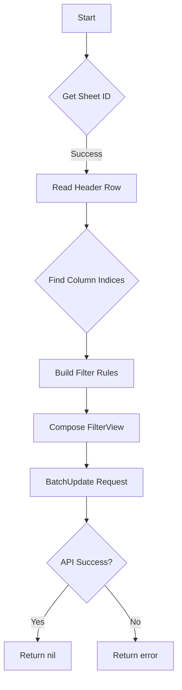

addFilterByFailedAndMandatoryToSheet`

**Location**

`cmd/certsuite/upload/results_spreadsheet/sheet_utils.go:115`

---

## Purpose

Adds a filter that shows only *failed* and *mandatory* rows in the **Conclusions** sheet of a Google Sheet.  
The function is used during the spreadsheet‑generation workflow after the conclusions data has been written to the target sheet.

> **Why it matters**  
> The spreadsheet is consumed by users who want to quickly spot problems that require attention. Filtering out all but failed and mandatory entries reduces visual noise and speeds up manual review.

---

## Signature

```go
func addFilterByFailedAndMandatoryToSheet(
    srv *sheets.Service,
    sp *sheets.Spreadsheet,
    sheetName string,
) error
```

| Parameter | Type                | Description |
|-----------|---------------------|-------------|
| `srv`     | `*sheets.Service`   | Google Sheets API client. Used for all API calls (`Get`, `Do`, `BatchUpdate`). |
| `sp`      | `*sheets.Spreadsheet` | The spreadsheet object that contains the target sheet. |
| `sheetName` | `string`          | Name of the sheet to apply the filter to (e.g., `ConclusionSheetName`). |

The function returns an error if any step fails; otherwise it returns `nil`.

---

## High‑level Flow

1. **Retrieve Sheet ID**  
   Uses `GetSheetIDByName` to translate `sheetName` into the numeric sheet ID required by the Sheets API.

2. **Read Header Row**  
   - Calls `GetHeadersFromValueRange` on the target sheet’s header row (row 1).  
   - Parses column names into a slice of strings.

3. **Locate Relevant Columns**  
   Using `GetHeaderIndicesByColumnNames`, it determines the zero‑based indices for:
   * `ResultsConclusionsCol` – the “Result” column
   * `WorkloadNameConclusionsCol` – the workload name column

4. **Build Filter Criteria**  
   Two filter rules are created:
   - **Failed rows**: value in *Result* column equals `"failed"`.
   - **Mandatory rows**: value in *Workload Name* column contains `"mandatory"`.

5. **Compose `FilterView`**  
   Constructs a `sheets.FilterView` object that applies the two rules to the entire sheet range (`A1:Z1000`, or as defined by constants).

6. **Apply via BatchUpdate**  
   Sends a single `BatchUpdateRequest` containing the `AddFilterView` request to the API.

7. **Return**  
   Any error from the HTTP calls is wrapped with context and returned; otherwise `nil`.

---

## Key Dependencies

| Called function | Purpose |
|-----------------|---------|
| `GetSheetIDByName` | Maps sheet name → ID |
| `GetHeadersFromValueRange` | Reads header row values |
| `GetHeaderIndicesByColumnNames` | Finds column indices for specific headers |
| `sheets.Service.Do`, `BatchUpdate` | Execute API requests |

All these helpers are defined in the same package (`resultsspreadsheet`) and operate on the Google Sheets API client.

---

## Side‑Effects & State Changes

* **Spreadsheet modification** – Adds a filter view to the target sheet.  
  Existing data is unchanged; only the UI representation is altered.
* No global state or file I/O is performed; the function is pure in terms of package variables.

---

## How It Fits the Package

The `resultsspreadsheet` command builds a Google Sheet that contains raw test results and derived conclusions.  
After populating the **Conclusions** sheet, the workflow calls:

```go
addFilterByFailedAndMandatoryToSheet(srv, sp, ConclusionSheetName)
```

This call is part of the finalization step, ensuring the resulting spreadsheet is ready for human consumption without further manual filtering.

---

## Suggested Mermaid Diagram



This diagram visualizes the sequential steps and decision points within `addFilterByFailedAndMandatoryToSheet`.
