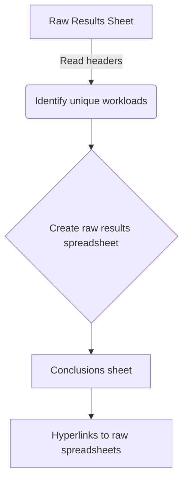

createConclusionsSheet`

```
func createConclusionsSheet(
    sService *sheets.Service,
    dService *drive.Service,
    rawResultsSheet *sheets.Sheet,
    title string,
) (*sheets.Sheet, error)
```

Creates a **Conclusions** sheet inside the Google‑Sheets workbook that contains
the aggregated view of all workloads processed in this run.  
The sheet is built from the data already present in the *Raw Results* sheet(s)
(`rawResultsSheet`) and contains one row per unique workload.

### Purpose

* Collate raw test results into a concise “conclusion” table.
* Provide quick navigation by linking each row back to its detailed
  Raw‑Results spreadsheet.
* Store the table as a separate worksheet so that other tools or users can
  reference it without needing to parse all raw data.

The resulting sheet has the following columns (in order):

| Column | Meaning |
|--------|---------|
| `Category` | Telco / Non‑Telco workload classification. |
| `Workload Version` | The version string of the workload. |
| `OCP Version` | The OpenShift Container Platform version used. |
| `Workload Name` | Human‑readable name of the workload. |
| `Results` | A hyperlink to the raw results spreadsheet for that workload. |

These column names are stored in the package variable `conclusionSheetHeaders`
and referenced by the constant indices defined in *const.go*.

### Parameters

| Parameter | Type | Description |
|-----------|------|-------------|
| `sService` | `*sheets.Service` | Google Sheets API client used to create and modify sheets. |
| `dService` | `*drive.Service` | Google Drive API client used for creating the folder that will hold the raw‑results spreadsheet. |
| `rawResultsSheet` | `*sheets.Sheet` | The sheet that already contains all raw test results; its rows are examined to extract unique workloads. |
| `title` | `string` | Title of the new Conclusions worksheet (usually “Conclusions”). |

### Workflow

1. **Prepare the folder**  
   Calls `createDriveFolder(dService, title)` to make a Drive folder that will
   hold any per‑workload raw results spreadsheets.

2. **Read headers from the Raw Results sheet**  
   * `GetHeadersFromSheet` fetches the first row of `rawResultsSheet`.  
   * `GetHeaderIndicesByColumnNames` maps column names to indices for later lookup.

3. **Identify unique workloads**  
   Iterates over every data row in `rawResultsSheet`, extracts:
   - Category
   - Workload Version
   - OCP Version
   - Workload Name  
   Builds a key string that uniquely identifies each workload and stores the
   corresponding row index (to avoid duplicates).

4. **Create per‑workload raw results spreadsheet**  
   For each unique workload, `createSingleWorkloadRawResultsSpreadSheet` is called to:
   * Create a new Google Sheet inside the folder from step 1.
   * Populate it with the rows that belong to that workload (filtered by the key).

5. **Build the Conclusions sheet**  
   For every unique workload:
   * Append a row to `conclusionRows` containing the five columns described above.
   * The “Results” column is a formula string in the form
     `=HYPERLINK("<url>", "link")`, where `<url>` points to the raw‑results sheet.

6. **Insert rows into the workbook**  
   Calls `append(sService, rawResultsSheet, conclusionRows)` to add all
   collected rows to a new worksheet named by `title`.

7. **Return**  
   The function returns the newly created `sheets.Sheet` object and any error
   that occurred during the process.

### Dependencies & Side‑Effects

| Dependency | Effect |
|------------|--------|
| `createDriveFolder` | Creates a Drive folder; may fail if permissions are missing. |
| `GetHeadersFromSheet`, `GetHeaderIndicesByColumnNames` | Read-only operations on `rawResultsSheet`. |
| `createSingleWorkloadRawResultsSpreadSheet` | Creates separate sheets and writes data to them. |
| `append` | Writes rows to the new Conclusions sheet; modifies the workbook. |

The function **does not** modify the original Raw Results sheet except for
reading its content. It creates a *new* worksheet within the same spreadsheet
and generates new Google Sheets files in Drive for each unique workload.

### Package Context

This helper lives in `github.com/redhat-best-practices-for-k8s/certsuite/cmd/certsuite/upload/results_spreadsheet`.  
It is used by the command‑line tool that uploads test results to a central
Google Sheet.  The resulting Conclusions sheet provides an overview that can
be consumed by other tooling or presented directly in Google Sheets.

--- 

**Mermaid diagram (optional)**



--- 

*If any referenced constant or helper function’s behaviour is unknown, the
documentation notes “unknown” for that part.*
