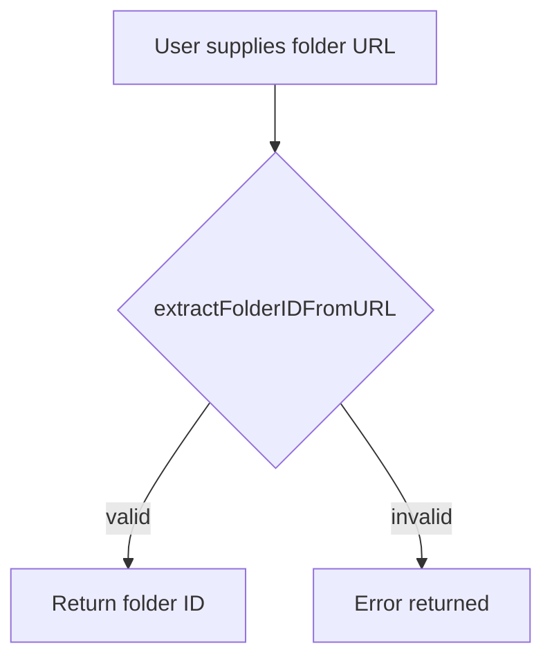

extractFolderIDFromURL`

### Purpose
Parses a Google Drive folder URL and returns the **folder ID** embedded in that URL.  
The function is used by the *results‑spreadsheet* command to locate the destination folder where generated spreadsheets should be uploaded.

### Signature
```go
func extractFolderIDFromURL(url string) (string, error)
```

| Parameter | Type   | Description |
|-----------|--------|-------------|
| `url`     | `string` | A full Google Drive URL that points to a folder, e.g. `https://drive.google.com/drive/folders/<folder-id>` |

| Return | Type    | Description |
|--------|---------|-------------|
| `string` | The extracted `<folder-id>` part of the URL |
| `error`  | Non‑nil if the input is not a valid Google Drive folder URL or if parsing fails. |

### Key Dependencies
- **`net/url.Parse`** – validates and splits the URL into its components.
- **`strings.Split`** – isolates path segments after the host part.
- **`len`** – ensures that at least one segment exists before accessing it.

No external packages are imported beyond the standard library, keeping this helper lightweight and testable.

### Algorithm (in prose)
1. Parse `url` using `url.Parse`. If parsing fails → return error.
2. Split the parsed path (`p.Path`) by `/`.
3. The folder ID is expected to be the **last** non‑empty segment of the path.  
   - If the slice contains no segments, or if the last segment is empty → return an error.
4. Return that segment as the folder ID.

### Side Effects
- None. The function only reads its input and returns a value; it does not modify global state or external resources.

### How It Fits the Package
The `resultsspreadsheet` command uploads generated CSV/Excel files to a Google Drive folder.  
Before calling the Drive API, it must know the numeric ID of that folder.  
`extractFolderIDFromURL` is invoked during flag validation (see `uploadResultSpreadSheetCmd`) to convert the user‑supplied URL into an ID that the rest of the package can use for authentication and file creation.

---

#### Suggested Mermaid diagram



This helper is intentionally small but critical for ensuring that the rest of the upload logic operates against the correct Drive resource.
