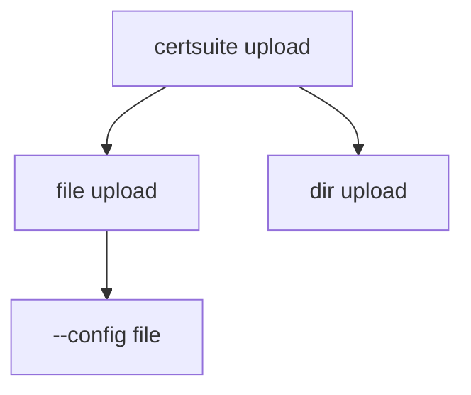

NewCommand` – upload sub‑command factory

| Aspect | Detail |
|--------|--------|
| **Package** | `upload` (under `cmd/certsuite/upload`) |
| **Signature** | `func() *cobra.Command` |
| **Purpose** | Constructs the top‑level Cobra command that implements the `certsuite upload` CLI functionality. |
| **Inputs / Outputs** | No arguments; returns a fully configured `*cobra.Command`. |
| **Key Dependencies** | - The local, unexported variable `upload`, which holds configuration/logic for performing the actual upload. - Two helper functions from the same package: <ul><li>`AddCommand` – attaches sub‑commands to the root command.</li> <li>`NewCommand` (recursive) – creates nested commands for specific upload targets (e.g., files, directories).</li></ul> |
| **Side Effects** | Instantiates and wires together Cobra commands; no global state is mutated beyond the construction of the command tree. |
| **Package Role** | This function is the entry point for the `upload` feature of the CertSuite CLI. It is invoked by the main application (`cmd/certsuite/main.go`) to register the upload sub‑command and its nested commands with Cobra's root command. |

### How it works

1. **Root command creation** – A new `*cobra.Command` instance is allocated (details omitted in this snippet).  
2. **Sub‑commands added** – `AddCommand` is called to attach child commands that implement specific upload actions. Each of those child commands may be created by recursively calling the same `NewCommand` function, allowing a tree structure.  
3. **Return value** – The fully assembled command is returned for registration with the CLI's root command.

> **Mermaid diagram suggestion** (if visualizing the command hierarchy):

This function keeps the CLI construction logic isolated from business logic, enabling easy testing and extension of sub‑commands.
