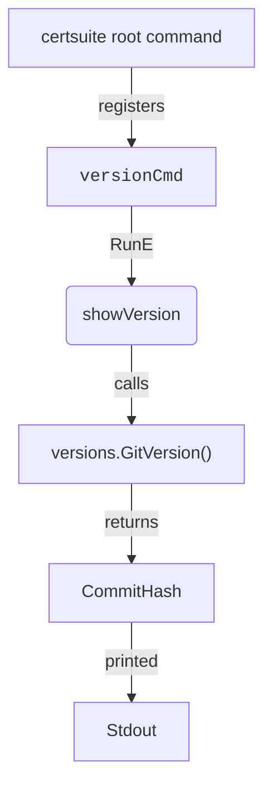

## Package version (github.com/redhat-best-practices-for-k8s/certsuite/cmd/certsuite/version)

# `cmd/certsuite/version` – Version Command

The **version** package supplies the `certsuite version` CLI sub‑command that reports
the binary’s build information (Git commit hash and semantic version).  
It is a thin wrapper around the common Cobra infrastructure used by the rest of
CertSuite.

---

## Global Variables

| Name | Type | Purpose |
|------|------|---------|
| `versionCmd` | *cobra.Command* (declared at line 11) | Holds the Cobra command that will be exposed as `<binary> version`. It is constructed in `NewCommand()` and later wired into the root command by the main package. |

---

## Key Functions

### 1. `showVersion`

```go
func showVersion(cmd *cobra.Command, args []string) error
```

* **Role** – The actual execution body of the `version` sub‑command.
* **Behavior**
  1. Prints the Git commit hash obtained from `versions.GitVersion()`.
  2. Prints the full semantic version string (from the same package).
  3. Returns `nil`, indicating success.

```go
cmd.Printf("Git commit: %s\n", versions.GitVersion())
cmd.Printf("certsuite version: %s\n", versions.GitVersion())
```

* **Dependencies** – Relies on `github.com/redhat-best-practices-for-k8s/certsuite/pkg/versions`.

---

### 2. `NewCommand`

```go
func NewCommand() *cobra.Command
```

* **Role** – Factory that creates and configures the Cobra command for the CLI.
* **Construction Steps**
  1. Initializes `versionCmd` with:
     - `Use: "version"`
     - `Short: "Prints certsuite build info"`
     - `RunE: showVersion`
  2. Returns the configured `*cobra.Command`.

This function is called by the root command during package initialization to
register the sub‑command.

---

## How They Connect

```
+--------------------+
|   Root Cobra Cmd   |
| (certsuite binary) |
+---------+----------+
          |
          | registers
          v
+---------------------+
| versionCmd (global) |
+---+-----------+-----+
    |           |
    | RunE -> showVersion
    |           |
    +-- prints --+
```

1. The root command (`certsuite`) imports this package and calls `NewCommand()`.
2. `NewCommand()` creates the global `versionCmd` with its execution function.
3. When a user runs `certsuite version`, Cobra invokes `showVersion`,
   which queries `versions.GitVersion()` and prints the result.

---

## Mermaid Diagram (Optional)



---

### Summary

* **Data flow**: CLI input → Cobra `RunE` handler (`showVersion`) → version package → output.
* **Extensibility**: Adding more build metadata (e.g., OS/arch) would involve extending the `versions` package and updating `showVersion`.
* **Current state**: The command simply prints the Git commit hash twice (once labeled as "Git commit" and once as "certsuite version").

This design keeps the version logic isolated, making it easy to test or replace without touching the rest of the CLI.

### Functions

- **NewCommand** — func()(*cobra.Command)

### Globals


### Call graph (exported symbols, partial)

```mermaid
graph LR
```

### Symbol docs

- [function NewCommand](symbols/function_NewCommand.md)
