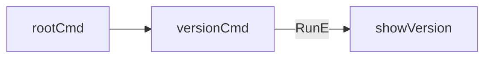

showVersion` – internal command handler

| Item | Details |
|------|---------|
| **Package** | `github.com/redhat-best-practices-for-k8s/certsuite/cmd/certsuite/version` |
| **Visibility** | Unexported (used only inside the package) |
| **Signature** | `func showVersion(cmd *cobra.Command, args []string) error` |

---

### Purpose
`showVersion` is the callback that implements the `version` sub‑command of the CertSuite CLI.  
When a user runs:

```bash
certsuite version
```

this function prints the current binary’s version information and then exits.

---

### Parameters

| Parameter | Type | Role |
|-----------|------|------|
| `cmd` | `*cobra.Command` | The Cobra command instance that triggered this handler. It is not used directly in the body, but it satisfies Cobra’s expected signature. |
| `args` | `[]string` | Arguments passed to the command. This implementation ignores them (no parameters are allowed for the version command). |

---

### Return value

- Returns an `error`.  
  The function always returns `nil`, indicating success; any printing error is ignored.

---

### Key operations

1. **Print header** – `cmd.Printf("certsuite v%s\n", GitVersion())`  
   *Calls* the package‑level `GitVersion()` helper (likely injected at build time via ldflags) to obtain the binary’s semantic version string, then prints it with a newline.

2. **Print commit hash** – `cmd.Printf("commit: %s\n", GitCommit())`  
   *Calls* the same helper for the git commit SHA and outputs it on a separate line.

3. **Return** – `return nil`

These two `Printf` calls use Cobra’s built‑in formatting to write to the command’s output stream (stdout by default).

---

### Dependencies

| Dependency | Source | Notes |
|------------|--------|-------|
| `cobra.Command.Printf` | Cobra library (`github.com/spf13/cobra`) | Used for formatted console output. |
| `GitVersion`, `GitCommit` | Package‑level helpers defined elsewhere in the same package | Provide build‑time metadata; usually set via linker flags. |

---

### Side effects

- Writes to stdout (or the command’s configured output stream).  
- Does **not** modify any global state or mutate inputs.

---

### Relationship to the rest of the package

The `version` package defines a single Cobra sub‑command, `versionCmd`, whose `RunE` field is set to `showVersion`.  
During application initialization (`cmd/certsuite/main.go`), this command gets added to the root command tree. Thus, invoking the CLI with the `version` flag triggers `showVersion`.



This tight coupling keeps the command logic isolated while exposing a clean interface for other parts of the application to register it.
