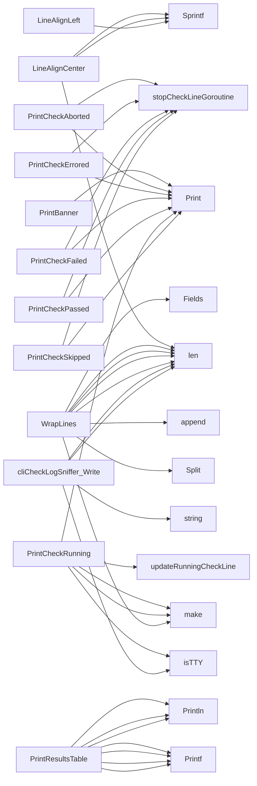

## Package cli (github.com/redhat-best-practices-for-k8s/certsuite/internal/cli)

### Structs

- **cliCheckLogSniffer**  — 0 fields, 1 methods

### Functions

- **LineAlignCenter** — func(string, int)(string)
- **LineAlignLeft** — func(string, int)(string)
- **LineColor** — func(string, string)(string)
- **PrintBanner** — func()()
- **PrintCheckAborted** — func(string, string)()
- **PrintCheckErrored** — func(string)()
- **PrintCheckFailed** — func(string)()
- **PrintCheckPassed** — func(string)()
- **PrintCheckRunning** — func(string)()
- **PrintCheckSkipped** — func(string, string)()
- **PrintResultsTable** — func(map[string][]int)()
- **WrapLines** — func(string, int)([]string)
- **cliCheckLogSniffer.Write** — func([]byte)(int, error)

### Globals

- **CliCheckLogSniffer**: 

### Call graph (exported symbols, partial)

### Symbol docs

- [function LineAlignCenter](symbols/function_LineAlignCenter.md)
- [function LineAlignLeft](symbols/function_LineAlignLeft.md)
- [function LineColor](symbols/function_LineColor.md)
- [function PrintBanner](symbols/function_PrintBanner.md)
- [function PrintCheckAborted](symbols/function_PrintCheckAborted.md)
- [function PrintCheckErrored](symbols/function_PrintCheckErrored.md)
- [function PrintCheckFailed](symbols/function_PrintCheckFailed.md)
- [function PrintCheckPassed](symbols/function_PrintCheckPassed.md)
- [function PrintCheckRunning](symbols/function_PrintCheckRunning.md)
- [function PrintCheckSkipped](symbols/function_PrintCheckSkipped.md)
- [function PrintResultsTable](symbols/function_PrintResultsTable.md)
- [function WrapLines](symbols/function_WrapLines.md)
- [function cliCheckLogSniffer.Write](symbols/function_cliCheckLogSniffer_Write.md)
