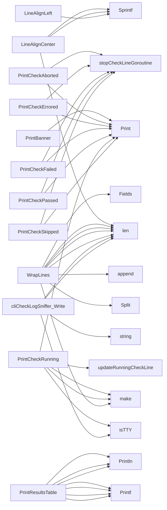

## Package cli (github.com/redhat-best-practices-for-k8s/certsuite/internal/cli)

# CLI package – quick reference

The **`github.com/redhat-best-practices-for-k8s/certsuite/internal/cli`** package provides a minimal, terminal‑only UI for the certsuite runner.  
It is intentionally lightweight: no external dependencies other than `golang.org/x/term`.  
All functions are exported and are meant to be called from the test harness; none of them modify global state except for a few channels that coordinate the “running check” line.

---

## 1. Global state

| Name | Type | Purpose |
|------|------|---------|
| `CliCheckLogSniffer` | `cliCheckLogSniffer` | Implements `io.Writer`. It is set as the custom handler in the logger (`slog`). All log output goes through this type, which writes a single line to the terminal (unless it’s a TTY) and pushes raw strings into `checkLoggerChan`. |
| `checkLoggerChan` | `chan string` | Receives raw log messages from the sniffer. The package never reads from it – it is used only by tests that want to inspect logs. |
| `stopChan` | `chan bool` | Signals the goroutine that updates the “running check” line to stop. |

*Constants for ANSI colors (`Red`, `Green`, …) and a clear‑line escape sequence (`ClearLineCode`) are defined but not used directly in this file – they’re exported so callers can colour their own output.*

---

## 2. Terminal helpers

| Function | Exported? | Signature | Role |
|----------|-----------|-----------|------|
| `isTTY()` | no | `func() bool` | Returns whether the current process is attached to a terminal (`IsTerminal(os.Stdout.Fd())`). All other functions that update the UI call this first. |
| `getTerminalWidth()` | no | `func() int` | Calls `term.GetSize(0)` and returns the column count; used to truncate long log lines so they fit on screen. |
| `cropLogLine(line string, width int) string` | no | trims a line to `width`, replacing the middle with “…”. |
| `WrapLines(text string, width int) []string` | yes | Splits a multi‑line string into slices that each fit within `width`. Useful for printing long messages in a columnar format. |

---

## 3. Line formatting helpers

These helpers return formatted strings; they do **not** write to stdout.

| Function | Exported? | Signature | Example use |
|----------|-----------|-----------|-------------|
| `LineAlignLeft(s string, width int) string` | yes | `func(string,int)(string)` | Pads `s` on the right with spaces so the total length is `width`. |
| `LineAlignCenter(s string, width int) string` | yes | `func(string,int)(string)` | Calculates left/right padding to centre `s` within `width`. |
| `LineColor(text, color string) string` | yes | `func(string,string)(string)` | Wraps `text` with ANSI escape codes for the given colour (e.g., “\x1b[31m”). |

---

## 4. Printing helpers

All of these functions write a single line to stdout (or whatever the default logger writes to). They **first** stop any running‑check goroutine (`stopCheckLineGoroutine`) to avoid interference, then print the status.

| Function | Exported? | Signature | Status tags |
|----------|-----------|-----------|-------------|
| `PrintBanner()` | yes | `func() ()` | Prints a static ASCII art banner stored in `banner`. |
| `PrintCheckRunning(name string)` | yes | `func(string) ()` | Starts a goroutine (`updateRunningCheckLine`) that repeatedly updates the same line with “name – RUNNING …” and a spinner. |
| `PrintCheckPassed(name string)` | yes | `func(string) ()` | Stops the running‑check line, prints `[PASS] name`. |
| `PrintCheckFailed(name string)` | yes | `func(string) ()` | Same as above but with `[FAIL]`. |
| `PrintCheckErrored(msg string)` | yes | `func(string) ()` | Prints `[ERROR] msg`. |
| `PrintCheckAborted(abortMsg, name string)` | yes | `func(string,string) ()` | Prints `[ABORTED] abortMsg – name`. |
| `PrintCheckSkipped(name, reason string)` | yes | `func(string,string) ()` | Prints `[SKIPPED] name – reason`. |

The “running” line is updated via the helper **`updateRunningCheckLine(name string, stop <-chan bool)`**:

1. Records the start time (`now := time.Now()`).
2. Creates a ticker with period `tickerPeriodSeconds` (default 1 s).  
3. In each tick, calls `printRunningCheckLine(name, now, spinnerChar)`.  
4. When `stopChan` receives a value or the goroutine is explicitly stopped, the ticker stops and the line is cleared.

**`printRunningCheckLine`** builds a string that includes:

- The elapsed time (`time.Since(start).Round(time.Second)`).
- A small spinner (cycling through “|/−\\”).
- A truncated version of the check name (`cropLogLine`).

It writes to stdout only if `isTTY()` is true; otherwise it does nothing, allowing non‑interactive runs to skip this UI.

---

## 5. Logger integration

The **`cliCheckLogSniffer.Write([]byte) (int, error)`** method implements the standard `io.Writer` interface. It is used as a custom handler for the slog logger:

```go
logger := slog.New(slog.NewTextHandler(os.Stdout, nil))
logger.SetHandler(cli.CliCheckLogSniffer)
```

When the logger writes, `Write()`:

1. Checks if we’re in a TTY; if not, it simply returns.
2. Converts the byte slice to a string and trims trailing newlines.
3. Sends the raw message on `checkLoggerChan` (for tests).
4. Prints the line directly to stdout.

The function is tiny but essential for keeping all output consistent with the UI helpers above.

---

## 6. Results table

**`PrintResultsTable(results map[string][]int) ()`** prints a summary of check counts per status tag:

```
   PASS: 12
   FAIL: 3
   SKIP: 1
   ERR: 0
   ABORTED: 0
```

The function iterates over the `results` map and uses `Printf`/`Println`. It is intentionally simple – callers pass a map keyed by the constants (`CheckResultTagPass`, etc.) with counts.

---

## 7. Flow diagram (textual)

```mermaid
flowchart TD
    A[Start check] --> B[PrintCheckRunning(name)]
    B --> C{Running?}
    C -- yes --> D[updateRunningCheckLine goroutine]
    D -->|Tick| E[printRunningCheckLine]
    E --> D
    C -- no --> F[stopCheckLineGoroutine]
    F --> G[PrintCheckPassed/Failed/Errored/etc.]
```

The goroutine (`D`) runs concurrently with the check logic; when a check finishes, `PrintCheckXxx` stops it and prints the final status.

---

## 8. Summary

* **UI** – centered on a single line that shows progress.
* **Logger hook** – captures all log output in real time.
* **Terminal detection** – disables UI features if not attached to a TTY.
* **Result aggregation** – simple table printer for test reports.

All functions are pure except those interacting with stdout and the global channels. The package is designed to be drop‑in: simply set `CliCheckLogSniffer` as your logger’s handler, call `PrintBanner()` once, then use the `PrintCheckXxx` helpers around each test function.

### Structs

- **cliCheckLogSniffer**  — 0 fields, 1 methods

### Functions

- **LineAlignCenter** — func(string, int)(string)
- **LineAlignLeft** — func(string, int)(string)
- **LineColor** — func(string, string)(string)
- **PrintBanner** — func()()
- **PrintCheckAborted** — func(string, string)()
- **PrintCheckErrored** — func(string)()
- **PrintCheckFailed** — func(string)()
- **PrintCheckPassed** — func(string)()
- **PrintCheckRunning** — func(string)()
- **PrintCheckSkipped** — func(string, string)()
- **PrintResultsTable** — func(map[string][]int)()
- **WrapLines** — func(string, int)([]string)
- **cliCheckLogSniffer.Write** — func([]byte)(int, error)

### Globals

- **CliCheckLogSniffer**: 

### Call graph (exported symbols, partial)



### Symbol docs

- [function LineAlignCenter](symbols/function_LineAlignCenter.md)
- [function LineAlignLeft](symbols/function_LineAlignLeft.md)
- [function LineColor](symbols/function_LineColor.md)
- [function PrintBanner](symbols/function_PrintBanner.md)
- [function PrintCheckAborted](symbols/function_PrintCheckAborted.md)
- [function PrintCheckErrored](symbols/function_PrintCheckErrored.md)
- [function PrintCheckFailed](symbols/function_PrintCheckFailed.md)
- [function PrintCheckPassed](symbols/function_PrintCheckPassed.md)
- [function PrintCheckRunning](symbols/function_PrintCheckRunning.md)
- [function PrintCheckSkipped](symbols/function_PrintCheckSkipped.md)
- [function PrintResultsTable](symbols/function_PrintResultsTable.md)
- [function WrapLines](symbols/function_WrapLines.md)
- [function cliCheckLogSniffer.Write](symbols/function_cliCheckLogSniffer_Write.md)
