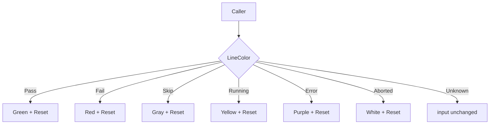

LineColor`

**Location**

```
internal/cli/cli.go:254
func LineColor(input, tag string) string
```

---

## Purpose

`LineColor` is a small helper that decorates a line of text with ANSI color codes based on a *status tag*.  
The function is used by the CLI progress‑and‑logging subsystem to print test results in a human‑readable way.

- **Input** – `input`: raw text (e.g., a log message or status string).  
- **Tag** – an identifier that represents the outcome of a check (`CheckResultTagPass`, `Fail`, `Skip`, etc.).

The function returns the same line wrapped in the appropriate color escape sequence so that when printed to a terminal it appears coloured.

---

## Inputs

| Parameter | Type   | Description |
|-----------|--------|-------------|
| `input`   | `string` | The text to colour. |
| `tag`     | `string` | One of the exported constants defined in this package (`CheckResultTagPass`, `Fail`, `Skip`, `Running`, `Error`, `Aborted`). |

---

## Output

- Returns a **single string**:  
  ```go
  fmt.Sprintf("%s%s%s", colorCode, input, Reset)
  ```
  where `colorCode` is chosen based on `tag`. If the tag does not match any known status, the function returns `input` unchanged.

---

## Key Dependencies

| Dependency | Role |
|-------------|------|
| **Colour constants** (`Red`, `Green`, `Yellow`, `Gray`, etc.) | ANSI escape codes defined at package level. |
| **Tag constants** (`CheckResultTagPass`, …) | Used in a `switch` statement to map tags → colours. |

No external packages are imported; all logic is self‑contained.

---

## Side Effects

- The function has **no side effects**: it does not modify global state, write to channels, or interact with I/O.
- It only performs string concatenation and a simple `switch`.

---

## Usage Context

`LineColor` is invoked by the CLI logger when emitting check results:

```go
line := LineColor(result.Text, result.Tag)
fmt.Fprintln(os.Stdout, line)
```

By centralising colour logic here, any change to the visual mapping (e.g., adding a new tag or changing a colour) can be made in one place without touching every call site.

---

## Mermaid Diagram



---

### Summary

`LineColor` is a pure, utility function that maps status tags to ANSI colour codes and wraps an input string accordingly. It plays a crucial role in the CLI's visual feedback for test execution results.
