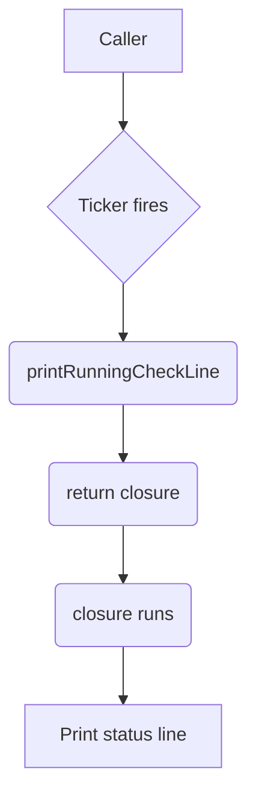

printRunningCheckLine`

### Purpose
`printRunningCheckLine` is an internal helper used by the **cli** package to render a single line of progress information for a running check.  
The function does *not* perform any I/O itself; instead it returns a closure that, when invoked, prints a formatted status string to `stdout`.  This design allows callers to repeatedly call the returned function (e.g., from a ticker) while keeping the formatting logic in one place.

### Signature
```go
func printRunningCheckLine(checkName string, start time.Time, duration string) func()
```

| Parameter | Type      | Description |
|-----------|-----------|-------------|
| `checkName` | `string` | The name of the check being executed.  It is shown in the log line. |
| `start`     | `time.Time` | Timestamp when the check started; used to compute elapsed time. |
| `duration`  | `string` | A pre‑formatted string that represents a fixed duration (e.g., “10s”). This value is displayed after the elapsed time. |

The function returns:
- **`func()`** – a closure that performs the actual printing when called.

### How it works
1. **Elapsed time calculation**  
   ```go
   elapsed := Round(Since(start), 100*time.Millisecond).String()
   ```
   * `Since(start)` gives the duration since the check began.  
   * The result is rounded to 100 ms for a clean display and converted to string.

2. **Terminal detection**  
   ```go
   if !isTTY() { return }
   ```
   If stdout is not a terminal (e.g., when output is redirected), the closure does nothing, avoiding unnecessary carriage‑return logic.

3. **Line formatting**  
   The log line has this layout:  

   ```
   <elapsed>  <checkName>  (<duration>)
   ```

   * `elapsed` and `<duration>` are padded to `lineLength` characters using spaces so that all lines align vertically.
   * The total width is limited by the current terminal width (obtained via `getTerminalWidth()`).
   * If the line would exceed the terminal width, it is cropped with `cropLogLine`.

4. **Printing**  
   ```go
   Print(ClearLineCode + paddedLine)
   ```
   * `ClearLineCode` (`"\x1b[2K\r"`) clears the current line and returns to its start.
   * The padded log line (with optional cropping) is then printed.

### Key dependencies
| Dependency | Role |
|------------|------|
| `Round`, `Since`, `String` | Time calculations. |
| `isTTY` | Detects whether stdout is a terminal. |
| `Print` | Wrapper around `fmt.Print`. |
| `getTerminalWidth` | Retrieves current terminal width for cropping. |
| `len`, `cropLogLine` | String length and truncation logic. |

### Side effects
* **Output** – writes to standard output only when stdout is a TTY.  
* **No state mutation** – the closure captures its arguments but does not modify any global variables.

### Context within the package
The **cli** package implements a command‑line interface for running certificate checks.  
`printRunningCheckLine` is used by the progress‑display routine that spawns a ticker (typically every second). The ticker calls the returned function to refresh the status line, giving users live feedback on how long a check has been running and its expected duration.

---  

**Mermaid diagram suggestion**


