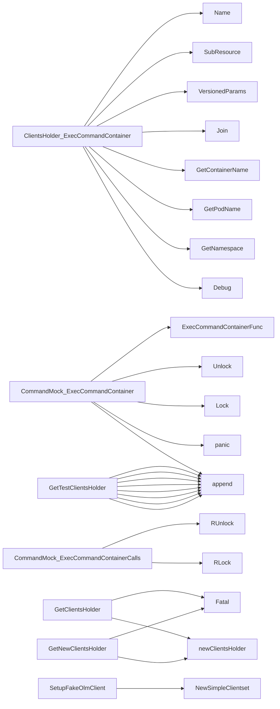

## Package clientsholder (github.com/redhat-best-practices-for-k8s/certsuite/internal/clientsholder)

### Structs

- **ClientsHolder** (exported) — 16 fields, 1 methods
- **CommandMock** (exported) — 3 fields, 2 methods
- **Context** (exported) — 3 fields, 3 methods

### Interfaces

- **Command** (exported) — 1 methods

### Functions

- **ClearTestClientsHolder** — func()()
- **ClientsHolder.ExecCommandContainer** — func(Context, string)(string, error)
- **CommandMock.ExecCommandContainer** — func(Context, string)(string, string, error)
- **CommandMock.ExecCommandContainerCalls** — func()([]struct{Context Context; S string})
- **Context.GetContainerName** — func()(string)
- **Context.GetNamespace** — func()(string)
- **Context.GetPodName** — func()(string)
- **GetClientConfigFromRestConfig** — func(*rest.Config)(*clientcmdapi.Config)
- **GetClientsHolder** — func(...string)(*ClientsHolder)
- **GetNewClientsHolder** — func(string)(*ClientsHolder)
- **GetTestClientsHolder** — func([]runtime.Object)(*ClientsHolder)
- **NewContext** — func(string, string, string)(Context)
- **SetTestClientGroupResources** — func([]*metav1.APIResourceList)()
- **SetTestK8sClientsHolder** — func(kubernetes.Interface)()
- **SetTestK8sDynamicClientsHolder** — func(dynamic.Interface)()
- **SetupFakeOlmClient** — func([]runtime.Object)()

### Globals

### Call graph (exported symbols, partial)

### Symbol docs

- [struct ClientsHolder](symbols/struct_ClientsHolder.md)
- [struct CommandMock](symbols/struct_CommandMock.md)
- [struct Context](symbols/struct_Context.md)
- [interface Command](symbols/interface_Command.md)
- [function ClearTestClientsHolder](symbols/function_ClearTestClientsHolder.md)
- [function ClientsHolder.ExecCommandContainer](symbols/function_ClientsHolder_ExecCommandContainer.md)
- [function CommandMock.ExecCommandContainer](symbols/function_CommandMock_ExecCommandContainer.md)
- [function CommandMock.ExecCommandContainerCalls](symbols/function_CommandMock_ExecCommandContainerCalls.md)
- [function Context.GetContainerName](symbols/function_Context_GetContainerName.md)
- [function Context.GetNamespace](symbols/function_Context_GetNamespace.md)
- [function Context.GetPodName](symbols/function_Context_GetPodName.md)
- [function GetClientConfigFromRestConfig](symbols/function_GetClientConfigFromRestConfig.md)
- [function GetClientsHolder](symbols/function_GetClientsHolder.md)
- [function GetNewClientsHolder](symbols/function_GetNewClientsHolder.md)
- [function GetTestClientsHolder](symbols/function_GetTestClientsHolder.md)
- [function NewContext](symbols/function_NewContext.md)
- [function SetTestClientGroupResources](symbols/function_SetTestClientGroupResources.md)
- [function SetTestK8sClientsHolder](symbols/function_SetTestK8sClientsHolder.md)
- [function SetTestK8sDynamicClientsHolder](symbols/function_SetTestK8sDynamicClientsHolder.md)
- [function SetupFakeOlmClient](symbols/function_SetupFakeOlmClient.md)
