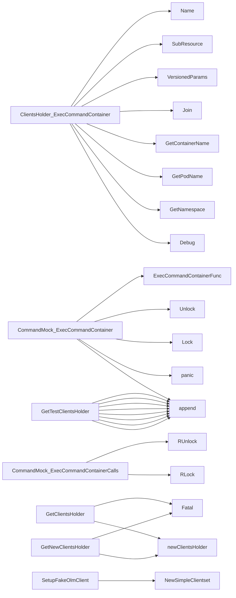

## Package clientsholder (github.com/redhat-best-practices-for-k8s/certsuite/internal/clientsholder)

## Overview of **`clientsholder`** package

The `clientsholder` package provides a singleton wrapper around all the Kubernetes / OpenShift client‑sets that are required by CertSuite tests and runtime logic.  
It also offers helper utilities for creating command execution contexts, mocking clients for unit tests, and converting between different client configuration representations.

---

### Key Data Structures

| Struct | Purpose | Important fields |
|--------|---------|------------------|
| **`ClientsHolder`** (exported) | Centralised access to all client‑sets. | `K8sClient`, `DynamicClient`, `OlmPkgClient`, `ApiserverClient`, `MachineCfg`, etc. <br>`RestConfig` – holds the raw kubeconfig used for creation. <br>`ready` – indicates whether the holder has been initialised successfully. |
| **`Context`** (exported) | Encapsulates a target pod/namespace/container for executing a command. | `namespace`, `podName`, `containerName`.  Methods `GetNamespace()`, `GetPodName()`, `GetContainerName()` expose them. |
| **`CommandMock`** (exported) | Mock implementation of the `Command` interface, generated by *moq*. Useful for unit tests that need to intercept calls to `ExecCommandContainer`. | Function field `ExecCommandContainerFunc` + call‑tracking fields (`calls`, mutex). |

---

### Global State

| Variable | Type | Role |
|----------|------|------|
| `clientsHolder` (unexported) | `*ClientsHolder` | The singleton instance used by the rest of CertSuite.  Created lazily by `GetClientsHolder`. |
| `_` (blank identifier) | `Command` | Compile‑time check that `CommandMock` satisfies the `Command` interface. |

---

### Core Interfaces

- **`Command`** – single method `ExecCommandContainer(Context, string)(string,error)` used to run a command inside a pod container.

---

### Main Functional Flow

1. **Singleton creation**
   - `GetClientsHolder(...string)`: returns the global holder; creates it via `newClientsHolder()` if not yet initialised.
   - `GetNewClientsHolder(string)`: forces recreation (useful when switching clusters).
   - `ClearTestClientsHolder()`: resets the singleton for tests that need a fresh instance.

2. **Client construction (`newClientsHolder`)**
   ```text
   1. Build a *rest.Config from kubeconfig or in‑cluster config.
   2. Create individual client‑sets:
        - K8s (core, networking, apps, autoscaling, etc.)
        - API extensions
        - OCP specific clients (machineconfig, apiserver, olm)
        - Dynamic client for CRDs
   3. Populate `GroupResources` via discovery.
   4. Store all in a `ClientsHolder` and set `ready=true`.
   ```

3. **Command execution (`ExecCommandContainer`)**
   - Uses the holder’s Kubernetes core client to obtain a request to the pod’s `/exec` sub‑resource.
   - Builds an SPDY executor with the current REST config.
   - Streams stdout/stderr, returning the combined output or error.

4. **Testing helpers**
   - `GetTestClientsHolder([]runtime.Object)`: replaces real clients with fake ones (`kubernetes/fake`, `clientset/fake`, etc.) for unit tests.
   - `SetTestK8sClientsHolder(kubernetes.Interface)` / `SetTestK8sDynamicClientsHolder(dynamic.Interface)` allow overriding specific interfaces.
   - `SetupFakeOlmClient([]runtime.Object)` creates a fake OLM client with supplied CR objects.

5. **Utility helpers**
   - `GetClientConfigFromRestConfig(*rest.Config)`: converts a `rest.Config` into the client‑cmd API config structure.
   - `createByteArrayKubeConfig(*clientcmdapi.Config)` serialises a kubeconfig to bytes (used when constructing `*rest.Config` from in‑cluster credentials).

---

### How Things Connect

``mermaid
graph TD
  subgraph Runtime
    GetClientsHolder -->|lazy init| newClientsHolder
    newClientsHolder --> ClientsHolder
    ExecCommandContainer -->|uses K8sClient.CoreV1()| podExec
    podExec --> SPDYExecutor
    SPDYExecutor --> StreamWithContext
  end

  subgraph Testing
    GetTestClientsHolder --> SetTestK8sClientsHolder
    SetTestK8sClientsHolder --> fakeK8sClient
    SetupFakeOlmClient --> fakeOlmClient
    CommandMock --> ExecCommandContainerCalls
  end

  ClientsHolder -->|provides| K8sClient, DynamicClient, OlmPkgClient, ...
```

- **Runtime path**: `GetClientsHolder` → `newClientsHolder` → fully initialised `ClientsHolder`.  
  When a test or component needs to run a command inside a pod, it calls `ExecCommandContainer`, which internally uses the core client from the holder.

- **Testing path**: `GetTestClientsHolder` replaces global clients with fakes. Tests can then inject `CommandMock` if they need to capture command execution without hitting an actual cluster.

---

### Important Constants

| Name | Value | Usage |
|------|-------|-------|
| `DefaultTimeout` | (not shown in JSON, but defined) | Timeout for REST calls or command execution; used by various helpers. |

---

### Summary

- **ClientsHolder** is the package’s heart – a singleton that bundles all Kubernetes/OpenShift client‑sets needed across CertSuite.
- The holder is lazily initialised from kubeconfig or in‑cluster config, and can be overridden for unit tests with fake clients.
- `ExecCommandContainer` abstracts pod command execution; it relies on the holder’s core client and REST configuration.
- Testing utilities (`GetTestClientsHolder`, `SetupFakeOlmClient`, etc.) provide isolated, pure‑k8s test environments without external dependencies.

### Structs

- **ClientsHolder** (exported) — 16 fields, 1 methods
- **CommandMock** (exported) — 3 fields, 2 methods
- **Context** (exported) — 3 fields, 3 methods

### Interfaces

- **Command** (exported) — 1 methods

### Functions

- **ClearTestClientsHolder** — func()()
- **ClientsHolder.ExecCommandContainer** — func(Context, string)(string, error)
- **CommandMock.ExecCommandContainer** — func(Context, string)(string, string, error)
- **CommandMock.ExecCommandContainerCalls** — func()([]struct{Context Context; S string})
- **Context.GetContainerName** — func()(string)
- **Context.GetNamespace** — func()(string)
- **Context.GetPodName** — func()(string)
- **GetClientConfigFromRestConfig** — func(*rest.Config)(*clientcmdapi.Config)
- **GetClientsHolder** — func(...string)(*ClientsHolder)
- **GetNewClientsHolder** — func(string)(*ClientsHolder)
- **GetTestClientsHolder** — func([]runtime.Object)(*ClientsHolder)
- **NewContext** — func(string, string, string)(Context)
- **SetTestClientGroupResources** — func([]*metav1.APIResourceList)()
- **SetTestK8sClientsHolder** — func(kubernetes.Interface)()
- **SetTestK8sDynamicClientsHolder** — func(dynamic.Interface)()
- **SetupFakeOlmClient** — func([]runtime.Object)()

### Globals


### Call graph (exported symbols, partial)



### Symbol docs

- [struct ClientsHolder](symbols/struct_ClientsHolder.md)
- [struct CommandMock](symbols/struct_CommandMock.md)
- [struct Context](symbols/struct_Context.md)
- [interface Command](symbols/interface_Command.md)
- [function ClearTestClientsHolder](symbols/function_ClearTestClientsHolder.md)
- [function ClientsHolder.ExecCommandContainer](symbols/function_ClientsHolder_ExecCommandContainer.md)
- [function CommandMock.ExecCommandContainer](symbols/function_CommandMock_ExecCommandContainer.md)
- [function CommandMock.ExecCommandContainerCalls](symbols/function_CommandMock_ExecCommandContainerCalls.md)
- [function Context.GetContainerName](symbols/function_Context_GetContainerName.md)
- [function Context.GetNamespace](symbols/function_Context_GetNamespace.md)
- [function Context.GetPodName](symbols/function_Context_GetPodName.md)
- [function GetClientConfigFromRestConfig](symbols/function_GetClientConfigFromRestConfig.md)
- [function GetClientsHolder](symbols/function_GetClientsHolder.md)
- [function GetNewClientsHolder](symbols/function_GetNewClientsHolder.md)
- [function GetTestClientsHolder](symbols/function_GetTestClientsHolder.md)
- [function NewContext](symbols/function_NewContext.md)
- [function SetTestClientGroupResources](symbols/function_SetTestClientGroupResources.md)
- [function SetTestK8sClientsHolder](symbols/function_SetTestK8sClientsHolder.md)
- [function SetTestK8sDynamicClientsHolder](symbols/function_SetTestK8sDynamicClientsHolder.md)
- [function SetupFakeOlmClient](symbols/function_SetupFakeOlmClient.md)
