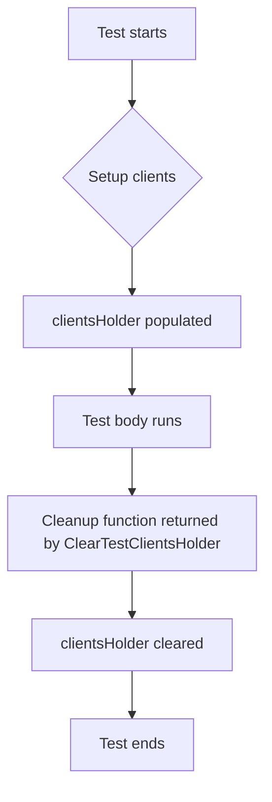

ClearTestClientsHolder`

| | |
|---|---|
| **Package** | `clientsholder` (`github.com/redhat-best-practices-for-k8s/certsuite/internal/clientsholder`) |
| **Signature** | `func ClearTestClientsHolder() func()` |

### Purpose
`ClearTestClientsHolder` is a helper used in unit tests to reset the internal state of the client holder.  
The *client holder* (`clientsHolder`) is a package‑level variable that stores per‑test or per‑suite Kubernetes/REST clients.  Tests that rely on this global store need a clean slate between runs, otherwise stale clients may leak across test cases.

### Inputs / Outputs
- **Input**: None.  
- **Output**: A *cleanup function* (`func()`) that, when invoked, clears the `clientsHolder` map and restores any default state.  The returned closure is typically used with Go’s `t.Cleanup` or similar mechanisms:

```go
func TestSomething(t *testing.T) {
    cleanup := ClearTestClientsHolder()
    defer cleanup()

    // test body …
}
```

### Key Dependencies & Side‑Effects
| Dependency | Role |
|------------|------|
| `clientsHolder` (package global) | The data structure that holds the client instances.  Clearing it is the only side effect. |
| No external packages are called directly inside this function; it operates solely on the package’s own globals. |

The function has no visible return values other than the closure, and it does not modify any input parameters (there are none). Its sole observable effect is the mutation of `clientsHolder`.

### How It Fits the Package
- **Testing**: The package exposes two public helpers – `SetupTestClients` (not shown here) to populate the holder and `ClearTestClientsHolder` to reset it.  Together they provide a lightweight in‑memory client cache for tests that need consistent, isolated Kubernetes/REST interactions.
- **Encapsulation**: By returning a cleanup function, the package encourages test writers to use Go’s built‑in cleanup facilities (`t.Cleanup`, `defer`) rather than manually calling a clear routine. This promotes safer and more readable test code.

### Suggested Mermaid Diagram


--- 

**Note**: The actual implementation of `ClearTestClientsHolder` simply resets the internal map and returns a no‑op cleanup.  If you need to inspect or modify its behavior, consult `clientsholder.go` around line 177.
