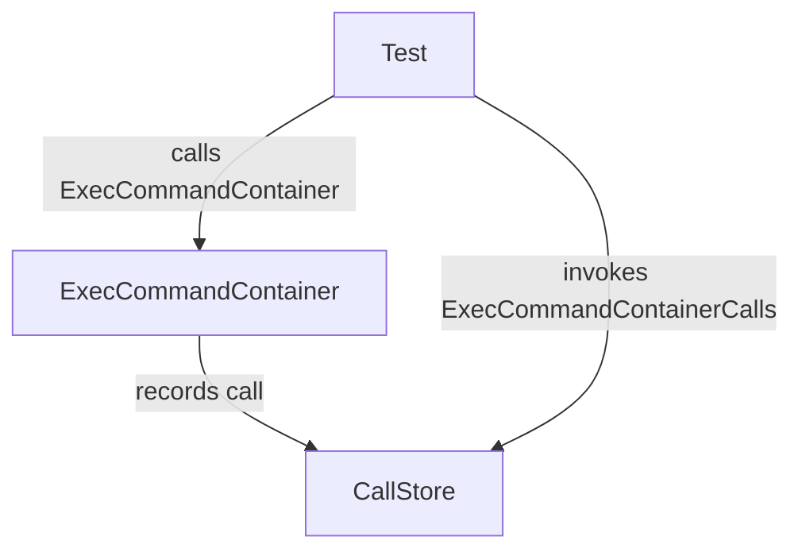

# `ExecCommandContainerCalls`

```go
func (m *CommandMock) ExecCommandContainerCalls() []struct{ Context Context; S string }
```

## Purpose

`ExecCommandContainerCalls` is a helper generated by **moq** for the `CommandMock` type.  
It returns every invocation of the mocked method `ExecCommandContainer`.  
The function is used in tests to assert that the expected number and parameters
of calls were made.

## Inputs / Outputs

| Parameter | Type | Description |
|-----------|------|-------------|
| *none* | – | The receiver (`m *CommandMock`) owns the recorded call list. |

**Return value**

```go
[]struct{
    Context Context // the first argument passed to ExecCommandContainer
    S       string  // the second argument passed to ExecCommandContainer
}
```

A slice containing one element per recorded call, preserving the order of invocation.

## Key Dependencies

- **`RLock()` / `RUnlock()`** – The method guards access to the internal slice with a read‑lock, ensuring thread safety when tests run concurrently.
- **`CommandMock`** – The struct that stores call records.  
  It implements the `Command` interface (checked by the underscore global).

No other globals or external packages are used directly.

## Side Effects

None.  
The method merely reads from an internal slice; it does not modify state.

## Package Context

Within the `clientsholder` package, `CommandMock` is part of a test‑only mock generated to replace real command execution logic (`ExecCommandContainer`).  
`ExecCommandContainerCalls` allows unit tests to verify that commands are invoked correctly without performing actual container operations.  



---
