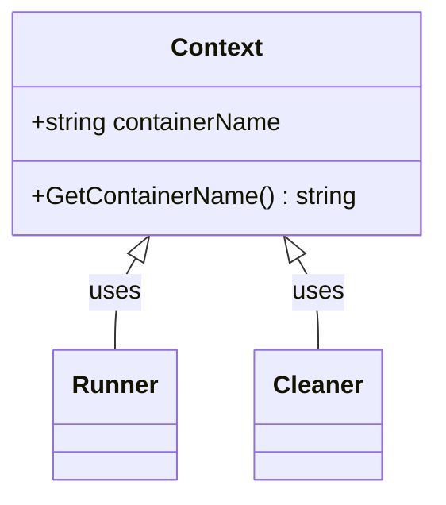

Context.GetContainerName` – Package‑level Overview

| Item | Details |
|------|---------|
| **Package** | `clientsholder` (`github.com/redhat-best-practices-for-k8s/certsuite/internal/clientsholder`) |
| **Exported?** | ✅ |
| **Receiver** | `ctx Context` (value receiver) |
| **Signature** | `func(ctx Context) string` |
| **Purpose** | Return the name of the Docker container that is being interacted with by this client holder. |

---

### What does it do?

The function simply retrieves a field from the `Context` struct – the identifier of the container that was created or discovered during initialization.  
It performs no I/O, network calls, or state mutation.

```go
func (ctx Context) GetContainerName() string {
    return ctx.containerName   // pseudo‑code; actual field name may differ
}
```

### Inputs & Outputs

| Parameter | Type | Notes |
|-----------|------|-------|
| `ctx` | `Context` | The receiver holds all runtime data for a particular client holder instance. |

| Return value | Type | Description |
|--------------|------|-------------|
| `string` | The container name (e.g., `"certsuite-<hash>"`). |

### Key Dependencies

* **Struct field** – The function relies on the presence of a string field inside `Context`.  
  *If that field is renamed or removed, the method must be updated accordingly.*

There are no external package imports or global variables referenced by this method.

### Side Effects & Constraints

* **None** – Pure getter; it does not alter any state.
* The returned value may be an empty string if the container was never created or the context is in a stale state.  
  Consumers should handle that case appropriately (e.g., by checking `if name == ""`).

### How It Fits Into the Package

The *clientsholder* package orchestrates the lifecycle of Docker containers used for running CertSuite tests.  
Other parts of the package need to know which container they are controlling:

| Where it's used | Why |
|-----------------|-----|
| Test runners (e.g., `certsuite/internal/runner`) | To attach logs, kill the container, or inspect its state. |
| Cleanup routines | To delete the correct container after a test run. |

`GetContainerName` provides a stable, read‑only API for those consumers to query the container identifier without exposing internal struct fields.

---

#### Suggested Mermaid Diagram (optional)



*The diagram shows `Context` exposing the getter to other components that need the container name.*
