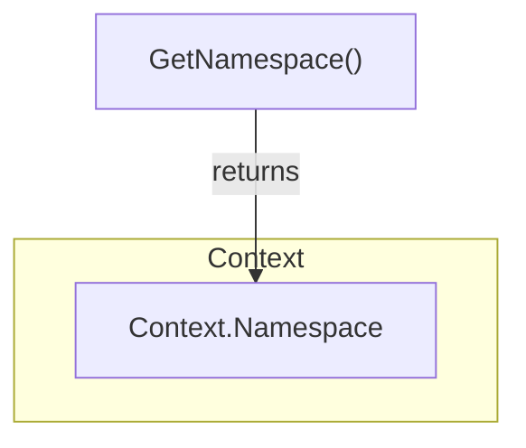

Context.GetNamespace`

```go
func (c *Context) GetNamespace() string
```

### Purpose
`GetNamespace` retrieves the Kubernetes namespace that the current client context is operating in.  
It is a read‑only helper used by other parts of the **clientsholder** package to
determine where resources should be created, queried or deleted.

### Inputs & Outputs
| Parameter | Type   | Description |
|-----------|--------|-------------|
| `c`       | `*Context` | The receiver; holds all runtime data for a client session. |

| Return | Type   | Description |
|--------|--------|-------------|
| string | Namespace name (e.g., `"default"`). If the namespace cannot be determined, an empty string is returned. |

### Key Dependencies
- **Context struct** – The function accesses `c.Namespace` or derives it from the current Kubernetes client configuration.
- No external packages are called; the method simply reads internal state.

### Side‑Effects
- None.  
  The method performs a pure read operation and does not modify any global or receiver fields.

### Package Role
Within `clientsholder`, this helper centralises namespace resolution so that all higher‑level operations (e.g., client creation, certificate requests) use the same source of truth. It keeps the logic for determining the target namespace in one place, simplifying maintenance and testing.

---

#### Suggested Mermaid Diagram



This diagram illustrates that `GetNamespace` simply returns the stored namespace value from the `Context`.
