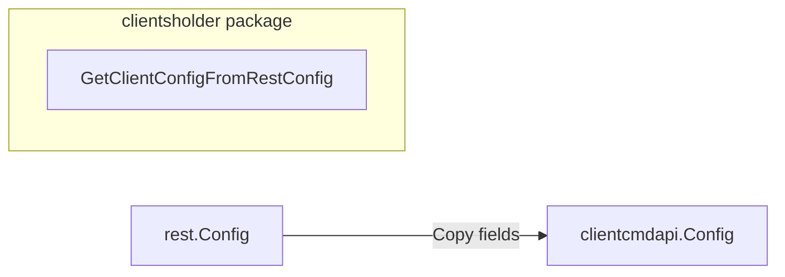

GetClientConfigFromRestConfig`

| Aspect | Detail |
|--------|--------|
| **Package** | `clientsholder` (github.com/redhat-best-practices-for-k8s/certsuite/internal/clientsholder) |
| **Exported?** | Yes (`GetClientConfigFromRestConfig`) |
| **Signature** | `func GetClientConfigFromRestConfig(cfg *rest.Config) *clientcmdapi.Config` |
| **Purpose** | Convert a Kubernetes `*rest.Config` (used by client-go for API communication) into the higher‑level `*clientcmdapi.Config` that is normally stored in a kubeconfig file.  This is needed because many certsuite components expect a kubeconfig‑style object even when they already have a live `rest.Config`. |
| **Inputs** | *`cfg`* – a pointer to a `rest.Config`. The function assumes the config is fully populated (e.g., it contains server URL, auth tokens, TLS settings). If `nil`, the function returns `nil`. |
| **Outputs** | A new `clientcmdapi.Config` instance that mirrors the values from `cfg`.  All fields are shallow‑copied; nested pointers are also copied. The returned config is suitable for passing to functions that accept a kubeconfig object. |
| **Key Dependencies** | * `k8s.io/client-go/rest` – provides the source configuration type. <br>* `k8s.io/client-go/tools/clientcmd/api/v1` (imported as `clientcmdapi`) – defines the target config type.<br> No external packages beyond standard Go and client‑go are used. |
| **Side Effects** | None. The function is pure: it does not modify its argument or any global state. It merely allocates a new struct and copies data into it. |
| **How it fits the package** | `clientsholder` holds a singleton of Kubernetes clients (`clientsHolder`).  Some operations inside this package (or in other packages that import it) receive an existing `rest.Config` from the holder but still need a kubeconfig representation—for example, when generating certificates or interacting with tools that expect the standard kubeconfig format.  This helper bridges that gap without requiring callers to duplicate conversion logic. |

### Example Usage

```go
import (
    "k8s.io/client-go/rest"
    csclientsholder "github.com/redhat-best-practices-for-k8s/certsuite/internal/clientsholder"
)

func main() {
    // Assume we already have a rest.Config from elsewhere.
    var rc *rest.Config

    kubeCfg := csclientsholder.GetClientConfigFromRestConfig(rc)
    if kubeCfg == nil {
        log.Fatal("failed to create kubeconfig")
    }

    // Now `kubeCfg` can be passed to any API that expects clientcmdapi.Config
}
```

### Suggested Mermaid Diagram (optional)



This function is a small, well‑encapsulated utility that keeps the rest of the codebase free from repetitive conversion logic.
