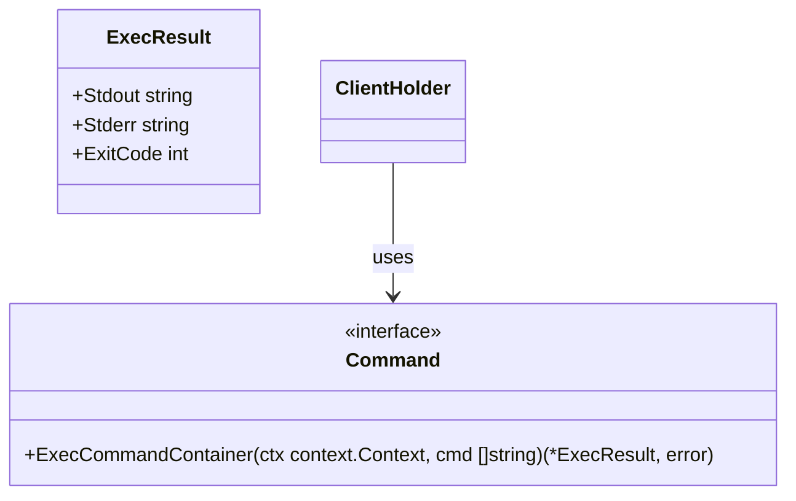

Command` Interface  
*(file: `internal/clientsholder/command.go`)*
  
### Purpose
The `Command` interface abstracts the execution of commands inside a container that is part of the *client‑holder* component of CertSuite.  
It allows callers to run an arbitrary command string in the context of a running pod/container and obtain the result (stdout, stderr, exit code) without exposing the underlying Kubernetes client or container runtime details.

### Method

| Name | Signature | Description |
|------|-----------|-------------|
| `ExecCommandContainer` | `func(ctx context.Context, cmd []string) (*ExecResult, error)` | Executes a command (`cmd`) in the target container and returns an `ExecResult`. |

* **Parameters**  
  * `ctx`: Context controlling cancellation or timeout for the exec operation.  
  * `cmd`: Slice of strings representing the command to run (e.g., `[]string{"sh", "-c", "echo hello"}`).

* **Returns**  
  * `*ExecResult`: A struct containing standard output, standard error and exit status of the executed command.  
  * `error`: Non‑nil if the exec request failed (network error, permission issue, etc.).

### Dependencies
- Relies on Kubernetes client-go’s `exec` capability (typically via `remotecommand.NewSPDYExecutor`).  
- Uses the pod/namespace information stored in the concrete implementation of `Command`.  
- Requires a valid kubeconfig and RBAC permissions to execute commands inside the target container.

### Side Effects
- The command is run **inside** the container; any side‑effects (file writes, environment changes) affect that container only.  
- No state is modified on the client or server beyond what the executed command does.  
- The method blocks until the command completes or the context is cancelled.

### Package Context
`clientsholder` orchestrates temporary Kubernetes clients for testing CertSuite workloads.  
The `Command` interface provides a clean abstraction so that tests and higher‑level helpers can invoke container commands without coupling to the specific exec implementation.  
Mock generation (`go:generate moq`) indicates that this interface is used in unit tests, enabling simulation of command execution.

---

#### Suggested Mermaid diagram

This diagram shows the interface’s relationship with `ClientHolder` and the result type.
