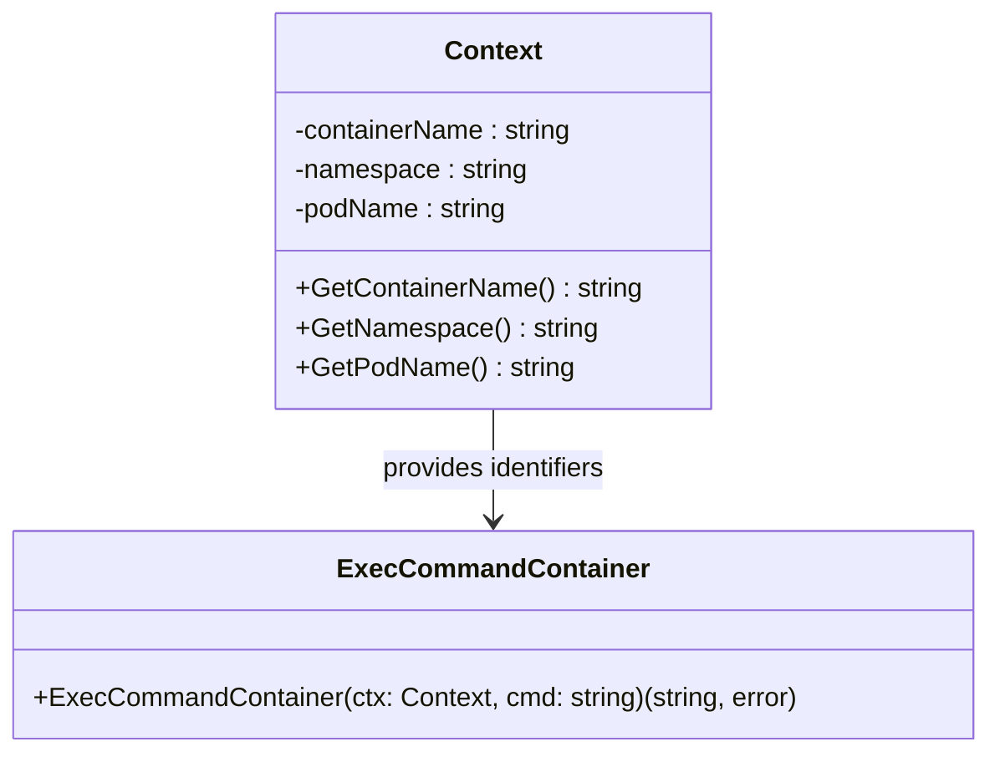

Context` – Namespace‑Scoped Execution Context

| Feature | Details |
|---------|---------|
| **Package** | `github.com/redhat-best-practices-for-k8s/certsuite/internal/clientsholder` |
| **Exported** | Yes (`type Context struct{…}`) |
| **Position in repo** | `clientsholder.go:372‑380` |

### Purpose
`Context` is a lightweight container that bundles the three identifiers needed to target a specific Kubernetes pod and its container:

1. **Namespace** – where the pod lives  
2. **Pod name** – the pod to operate on  
3. **Container name** – which container inside the pod

It is used throughout `clientsholder` as the argument type for functions that need to execute commands, read logs, or perform other per‑container actions. By encapsulating these values, callers avoid passing three separate strings and keep the API tidy.

### Construction
```go
ctx := NewContext(namespace, podName, containerName)
```
* `NewContext` is a simple constructor (see package docs) that returns a fully populated `Context`.  
* The function accepts raw string values; it performs no validation or transformation.

### Accessors
All fields are unexported, so callers must use the provided getters:

| Method | Signature | Return |
|--------|-----------|--------|
| `GetNamespace()` | `func (c Context) GetNamespace() string` | Namespace value |
| `GetPodName()`    | `func (c Context) GetPodName() string`     | Pod name       |
| `GetContainerName()` | `func (c Context) GetContainerName() string` | Container name |

These are used by higher‑level helpers such as:

- `ClientsHolder.ExecCommandContainer(ctx, cmd)` – executes a command in the container referenced by `ctx`.
- Any other helper that needs to build a Kubernetes API request.

### Key Dependencies
| Dependency | Role |
|------------|------|
| **Kubernetes client-go** | The context values are fed into `RESTClient` calls (e.g., `client.CoreV1().Pods(namespace).Exec(...)`) to perform actions on the target pod/container. |
| **clientsholder package itself** | Functions in this package (`ExecCommandContainer`, etc.) call the getters to obtain the namespace, pod name, and container name before building request URLs or SPDY executors. |

### Side‑Effects & Constraints
* The struct holds only strings; it does not own any client objects or perform I/O.  
* Because fields are unexported, external packages cannot mutate a `Context` after creation – immutability is enforced by design.

### How It Fits the Package
The `clientsholder` package abstracts away Kubernetes client boilerplate. `Context` is the central piece of that abstraction: it carries the minimal information required to identify where an operation should occur, allowing all other helpers to remain stateless and pure from a caller’s perspective.

> **Example Flow**  
> ```go
> ctx := NewContext("prod", "web-frontend-7d8c5", "nginx")
> out, err := clientsholder.ExecCommandContainer(ctx, "cat /etc/passwd")
> ```
> Internally `ExecCommandContainer` pulls the namespace, pod, and container from `ctx`, builds an API request, streams the command output, and returns it.

### Suggested Diagram


This concise representation shows how `Context` feeds into the command‑execution logic without exposing internal fields.
