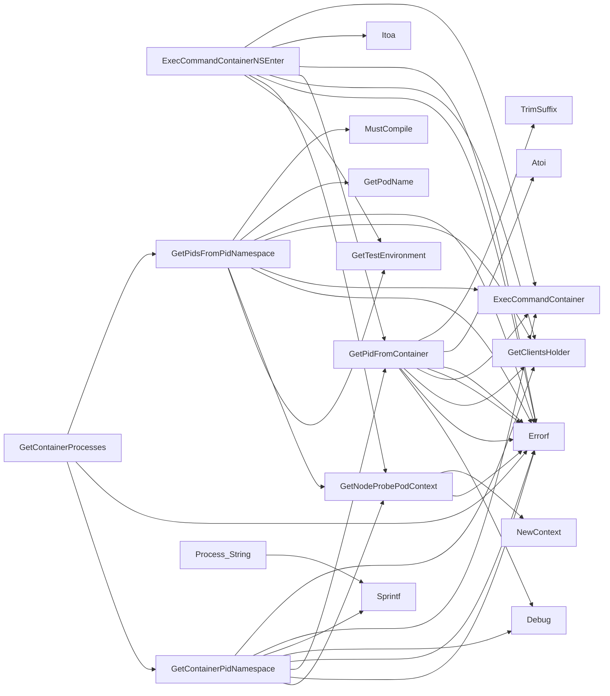

## Package crclient (github.com/redhat-best-practices-for-k8s/certsuite/internal/crclient)

### Structs

- **Process** (exported) — 4 fields, 1 methods

### Functions

- **ExecCommandContainerNSEnter** — func(string, *provider.Container)(string, error)
- **GetContainerPidNamespace** — func(*provider.Container, *provider.TestEnvironment)(string, error)
- **GetContainerProcesses** — func(*provider.Container, *provider.TestEnvironment)([]*Process, error)
- **GetNodeProbePodContext** — func(string, *provider.TestEnvironment)(clientsholder.Context, error)
- **GetPidFromContainer** — func(*provider.Container, clientsholder.Context)(int, error)
- **GetPidsFromPidNamespace** — func(string, *provider.Container)([]*Process, error)
- **Process.String** — func()(string)

### Call graph (exported symbols, partial)

### Symbol docs

- [struct Process](symbols/struct_Process.md)
- [function ExecCommandContainerNSEnter](symbols/function_ExecCommandContainerNSEnter.md)
- [function GetContainerPidNamespace](symbols/function_GetContainerPidNamespace.md)
- [function GetContainerProcesses](symbols/function_GetContainerProcesses.md)
- [function GetNodeProbePodContext](symbols/function_GetNodeProbePodContext.md)
- [function GetPidFromContainer](symbols/function_GetPidFromContainer.md)
- [function GetPidsFromPidNamespace](symbols/function_GetPidsFromPidNamespace.md)
- [function Process.String](symbols/function_Process_String.md)
