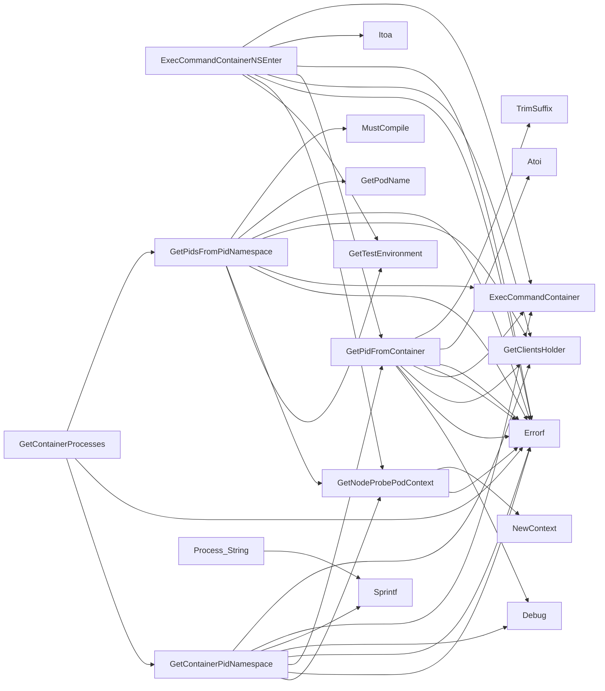

## Package crclient (github.com/redhat-best-practices-for-k8s/certsuite/internal/crclient)

# crclient – Container‑Runtime Helper Package

`crclient` provides a thin abstraction layer for inspecting container processes and namespaces on the node where a test pod is running.  
It relies on the generic **provider** types (`Container`, `TestEnvironment`) from the rest of *certsuite* and on the shared client holder that knows how to talk to the Kubernetes API and to the underlying node.

> **Key Idea** – All commands run inside the *probe pod* (the first container of a special “node‑probe” pod).  
> That pod is scheduled on the same node as the test pod, so any `nsenter` or `ps` command executed there sees the exact namespace layout that the target container has.

---

## Data Structures

| Name | Purpose | Key fields |
|------|---------|------------|
| **Process** (exported) | Representation of a process seen inside a PID namespace. | `Args`, `PPid`, `Pid`, `PidNs` – all ints or strings that are filled by parsing the output of `/proc/<pid>/stat`. |
| **String() string** | Stringer implementation for debugging and logging. Formats the struct as `"Process{PID: %d, PPID: %d, NS: %d, Args: %s}"`. |

---

## Global Constants

| Const | Value (source) | Usage |
|-------|----------------|-------|
| `DevNull` | `"/dev/null"` | Passed to commands that need a dummy output file. |
| `DockerInspectPID` | `"docker inspect -f '{{ .State.Pid }}' {{ .Name }}"` | Used by the probe pod to ask Docker for the PID of a container (only when the runtime is Docker). |
| `PsRegex` | `^([0-9]+)\s+([0-9]+)\s+(?:[a-zA-Z]+)\s+([0-9]+)` | Regex that extracts `<PID> <PPID> <NS>` from `ps -e -o pid,ppid,pidns`. |
| `RetryAttempts` | `3` | Number of times a command is retried when it fails. |
| `RetrySleepSeconds` | `2` | Seconds to wait between retries. |

---

## Core Functions

### 1. `GetNodeProbePodContext`

```go
func GetNodeProbePodContext(node string, env *provider.TestEnvironment) (clientsholder.Context, error)
```

*Builds a **clientsholder.Context** that is bound to the first container of the probe pod running on the given node.*  
The context contains:

| Component | Description |
|-----------|-------------|
| `PodName`  | The name of the probe pod (first pod in the list returned by the API). |
| `Container` | The first container inside that pod. |
| `Namespace` | Namespace of the test pod – needed for command execution. |

The function returns an error if no probe pod is found or if the pod has no containers.

---

### 2. `GetPidFromContainer`

```go
func GetPidFromContainer(container *provider.Container, ctx clientsholder.Context) (int, error)
```

*Returns the **PID** of a container as seen on its host node.*

1. Calls `ExecCommandContainer` to run the `docker inspect` command inside the probe pod.  
2. Parses the output into an integer.  
3. Logs and returns errors if anything goes wrong.

---

### 3. `GetContainerPidNamespace`

```go
func GetContainerPidNamespace(container *provider.Container, env *provider.TestEnvironment) (string, error)
```

*Determines the **PID namespace** identifier of a container.*

1. Uses `GetNodeProbePodContext` to obtain a context for the probe pod on the node where the container lives.  
2. Calls `ExecCommandContainer` with `ps -e -o pid,ppid,pidns` and filters for the PID returned by `GetPidFromContainer`.  
3. Extracts the namespace number from the matching line.  

The returned string is used as the *key* when looking up all processes inside that namespace.

---

### 4. `GetPidsFromPidNamespace`

```go
func GetPidsFromPidNamespace(pidns string, container *provider.Container) ([]*Process, error)
```

*Collects **all** processes running in a given PID namespace.*

1. Executes the same `ps` command as above via the probe pod context.  
2. Uses the regular expression `PsRegex` to parse each line into `<PID> <PPID> <NS>` tuples.  
3. Builds a slice of `Process` structs, filling in `Args` with the full `/proc/<pid>/cmdline`.  

If any line cannot be parsed, an error is returned.

---

### 5. `GetContainerProcesses`

```go
func GetContainerProcesses(container *provider.Container, env *provider.TestEnvironment) ([]*Process, error)
```

Convenience wrapper that:

1. Calls `GetContainerPidNamespace` to discover the namespace of the container.  
2. Calls `GetPidsFromPidNamespace` with that namespace to get all processes.

---

### 6. `ExecCommandContainerNSEnter`

```go
func ExecCommandContainerNSEnter(cmd string, container *provider.Container) (string, error)
```

*Runs a command inside the **container’s own PID namespace** by using `nsenter`.*

1. Retrieves the test environment and probe pod context.  
2. Obtains the container’s host‑node PID via `GetPidFromContainer`.  
3. Constructs an `nsenter` command that switches to the target PID namespace (`--target <pid> --pid`) and then executes `cmd`.  
4. Retries up to `RetryAttempts`, sleeping `RetrySleepSeconds` between attempts.  

The function returns the combined stdout/stderr of the executed command.

---

## Typical Flow

```text
probe pod (on node X)
   └─ exec "docker inspect" → container PID on host
      │
      └─ exec "ps -e -o pid,ppid,pidns" → find namespace ID
         │
         └─ exec "nsenter --pid=PIDNS ... cmd" → run arbitrary command in container’s NS
```

The helper functions hide the plumbing of:

* finding the probe pod that shares a node with the target,
* converting between container IDs, host PIDs and PID namespaces,
* retrying commands robustly.

---

## Suggested Mermaid Diagram

```mermaid
flowchart TD
    subgraph ProbePod[Probe Pod (node X)]
        A1[Get Docker Inspect PID] --> B1[PID on Host]
        B1 --> C1[Exec ps -e -o pid,ppid,pidns]
        C1 --> D1[Parse Namespace ID]
        D1 --> E1[Exec nsenter --pid=NS ... cmd]
    end

    subgraph TargetContainer[Target Container]
        F1[Container ID] -.-> A1
        F2[Container PID] -.-> B1
    end
```

---

## What’s *unknown*?

The package depends on several helper functions (`ExecCommandContainer`, `GetTestEnvironment`, `GetClientsHolder`, etc.) that are defined elsewhere in the repository.  
Their signatures suggest they perform remote command execution and client‑session management, but their exact implementation is outside this file.

---

### Structs

- **Process** (exported) — 4 fields, 1 methods

### Functions

- **ExecCommandContainerNSEnter** — func(string, *provider.Container)(string, error)
- **GetContainerPidNamespace** — func(*provider.Container, *provider.TestEnvironment)(string, error)
- **GetContainerProcesses** — func(*provider.Container, *provider.TestEnvironment)([]*Process, error)
- **GetNodeProbePodContext** — func(string, *provider.TestEnvironment)(clientsholder.Context, error)
- **GetPidFromContainer** — func(*provider.Container, clientsholder.Context)(int, error)
- **GetPidsFromPidNamespace** — func(string, *provider.Container)([]*Process, error)
- **Process.String** — func()(string)

### Call graph (exported symbols, partial)



### Symbol docs

- [struct Process](symbols/struct_Process.md)
- [function ExecCommandContainerNSEnter](symbols/function_ExecCommandContainerNSEnter.md)
- [function GetContainerPidNamespace](symbols/function_GetContainerPidNamespace.md)
- [function GetContainerProcesses](symbols/function_GetContainerProcesses.md)
- [function GetNodeProbePodContext](symbols/function_GetNodeProbePodContext.md)
- [function GetPidFromContainer](symbols/function_GetPidFromContainer.md)
- [function GetPidsFromPidNamespace](symbols/function_GetPidsFromPidNamespace.md)
- [function Process.String](symbols/function_Process_String.md)
