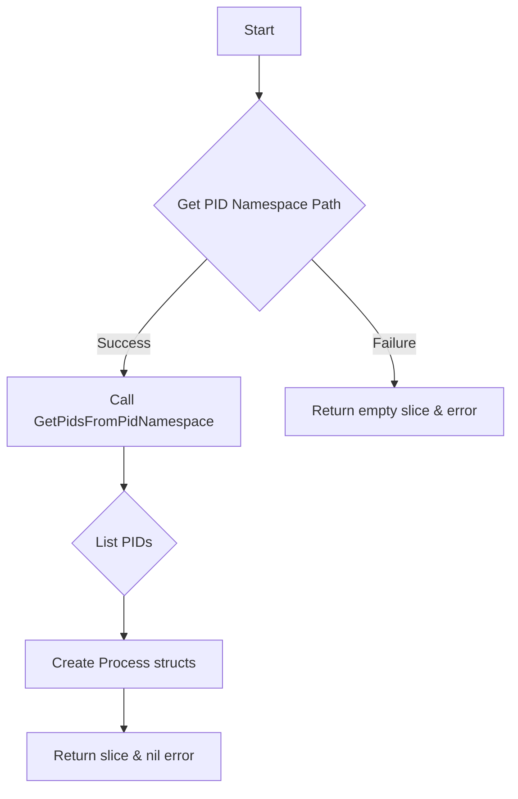

GetContainerProcesses`

**Package:** `crclient`  
**Location:** `internal/crclient/crclient.go:111`  

---

## Purpose
Retrieve a list of all processes that are running **inside the PID namespace of a given container**.  
The function is used by the test harness to introspect container state (e.g., for debugging, audit, or validation purposes).

---

## Signature

```go
func GetContainerProcesses(container *provider.Container,
                           env      *provider.TestEnvironment) ([]*Process, error)
```

| Parameter | Type                     | Description |
|-----------|--------------------------|-------------|
| `container` | `*provider.Container` | The container whose processes are to be enumerated. |
| `env`        | `*provider.TestEnvironment` | Test‑environment context (e.g., kubeconfig, namespace). |

**Return values**

- `[]*Process` – slice of pointers to `Process` structs describing each process found in the container’s PID namespace.
- `error`      – non‑nil if any step fails (e.g., unable to locate the namespace or read `/proc`).

---

## Key Steps & Dependencies

1. **Locate the container's PID namespace**  
   Calls `GetContainerPidNamespace(container, env)` which resolves the path to the namespace file (`/proc/<pid>/ns/pid`) for the container’s main process.

2. **Enumerate PIDs in that namespace**  
   Invokes `GetPidsFromPidNamespace(pidNsPath)` (where `pidNsPath` is the result from step 1).  
   This function scans `/proc` entries, filters those belonging to the target namespace, and returns a slice of PIDs.

3. **Build `Process` objects**  
   For each PID returned, the code constructs a `Process` instance (definition in another file) containing details such as command line, UID/GID, etc.  

4. **Return results**  
   The slice of `*Process` is returned alongside any error that occurred during the steps above.

---

## Side‑Effects

- No global state is modified.
- Only read operations are performed on the host’s `/proc` filesystem and container metadata; no network or I/O side effects beyond those required to inspect the namespace.

---

## Usage Context

The function is part of the `crclient` package, which provides a lightweight client for interacting with containers in a Kubernetes cluster.  
Typical callers:

```go
procs, err := crclient.GetContainerProcesses(container, env)
if err != nil {
    // handle error
}
for _, p := range procs {
    fmt.Println(p.Pid, p.Cmdline)
}
```

It is often used by higher‑level test functions that need to assert that a container started the expected set of processes or to debug failures.

---

## Suggested Mermaid Flowchart



---

### Unknowns

- The exact fields of the `Process` struct are defined elsewhere; this documentation assumes it contains at least PID and command line information.
