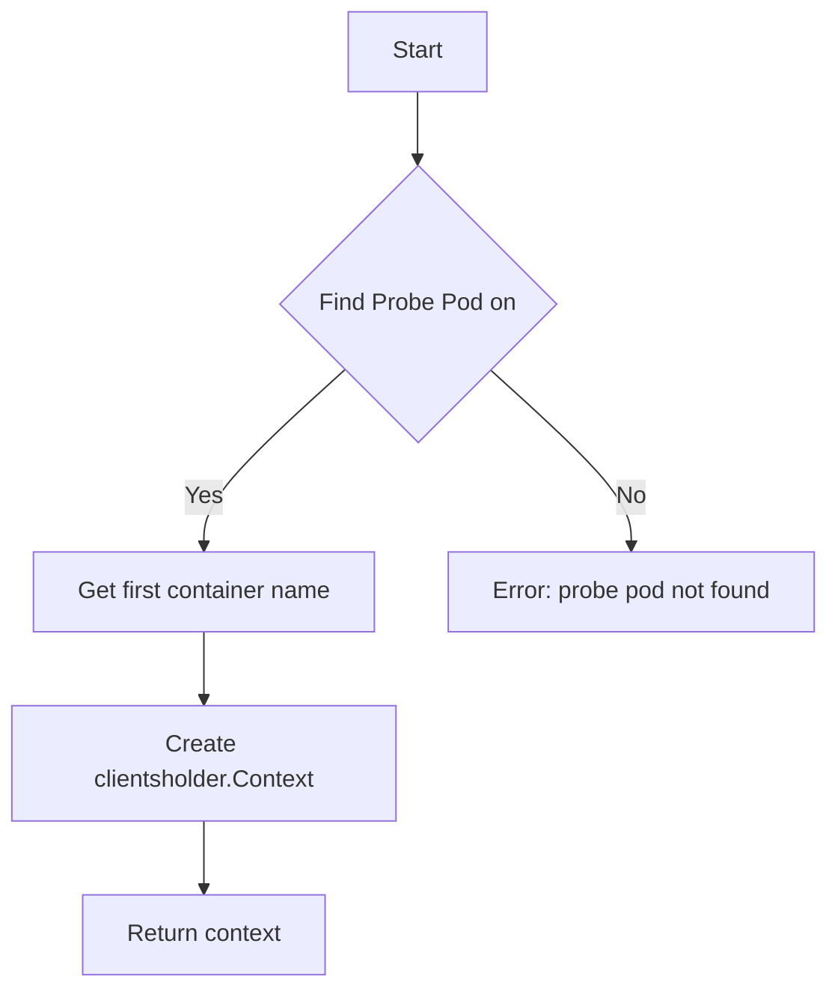

GetNodeProbePodContext`

```go
func GetNodeProbePodContext(node string, env *provider.TestEnvironment) (clientsholder.Context, error)
```

### Purpose  
`GetNodeProbePodContext` locates the first container inside the **probe pod** that is scheduled on a specific Kubernetes node and returns a `clientsholder.Context` for that container.  
The context is used to execute commands against the node’s runtime (e.g., Docker, CRI‑O) from within the probe pod, allowing tests to introspect or manipulate the host environment where the target workload runs.

### Parameters  

| Name | Type | Description |
|------|------|-------------|
| `node` | `string` | The name of the node on which the target pod is running. |
| `env` | `*provider.TestEnvironment` | Test environment object that holds references to Kubernetes clients, namespace information, and other test‑specific data. |

### Returns  

| Return value | Type | Description |
|--------------|------|-------------|
| `clientsholder.Context` | Context of the first container in the probe pod | Provides a session that can run commands inside that container. |
| `error` | error | Non‑nil if the probe pod cannot be found, if it contains no containers, or if context creation fails. |

### Key Dependencies  

* **`provider.TestEnvironment`** – supplies the Kubernetes client (`env.Client`) and namespace used to query pods.
* **`clientsholder.NewContext`** – creates a `clientsholder.Context` from a pod name, container name, namespace, and an optional host path (used here as empty).
* **`errors.Errorf`** – used for error wrapping.

### Side‑Effects  

None.  
The function only reads the cluster state and constructs a context object; it does not modify any resources.

### How It Fits in `crclient`

`crclient` is responsible for interacting with container runtimes (Docker, CRI‑O) on test nodes.  
This helper:

1. **Locates** the probe pod that runs on the node of interest.
2. **Identifies** the first container inside that pod – the probe’s runtime interface.
3. **Returns** a ready‑to‑use context for executing host‑level commands from tests.

It is used by higher‑level test helpers when they need to reach into a node from within the probe pod, e.g., to check kernel modules, inspect cgroup hierarchies, or validate network interfaces.

---

#### Suggested Mermaid Flow



---
