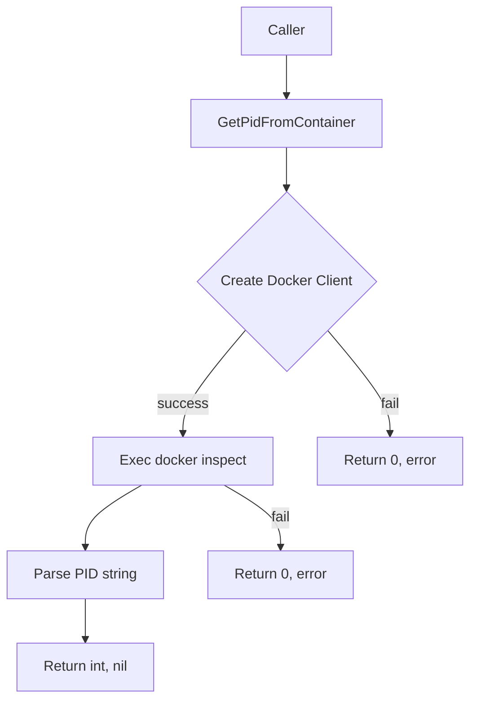

GetPidFromContainer`

| Item | Details |
|------|---------|
| **Package** | `crclient` (`github.com/redhat-best-practices-for-k8s/certsuite/internal/crclient`) |
| **Exported** | ✅ |
| **Signature** | `func GetPidFromContainer(container *provider.Container, ctx clientsholder.Context) (int, error)` |

### Purpose
`GetPidFromContainer` retrieves the PID of a process that is running inside a Docker container.  
It does this by executing the `docker inspect` command for the given container ID and parsing the resulting JSON to extract the PID field.

> **Why it matters** – Many tests in CertSuite need to interact with binaries that are launched inside containers (e.g., `oc`). Knowing the PID allows the test harness to signal or monitor these processes directly from the host.

### Parameters
| Parameter | Type | Description |
|-----------|------|-------------|
| `container` | `*provider.Container` | A reference to a container managed by the test framework. It must have a non‑empty `ContainerID`. |
| `ctx` | `clientsholder.Context` | Context used for Docker client operations (e.g., timeout, cancellation). |

### Return Values
| Return | Type | Meaning |
|--------|------|---------|
| `int` | PID of the process inside the container. | On success, this is a positive integer; on failure, it is zero. |
| `error` | Error value | Non‑nil if any step fails: Docker client creation, command execution, JSON parsing, or conversion to int. |

### Key Dependencies
| Dependency | Role |
|------------|------|
| `GetClientsHolder()` | Retrieves a Docker client configured for the current test context. |
| `ExecCommandContainer(containerID, cmd)` | Executes a shell command inside the container; used here with `docker inspect`. |
| `Debug`, `Errorf` (from the package’s logger) | Emit diagnostic messages. |
| Standard library helpers (`Atoi`, `TrimSuffix`) | Convert the PID string to an integer and clean up trailing newlines. |

### Algorithm Overview
1. **Log start** – emit a debug message with the container ID.
2. **Create Docker client** – call `GetClientsHolder()`; if it fails, return an error.
3. **Inspect command** – build and run `docker inspect --format '{{ .State.Pid }}' <container-id>` via `ExecCommandContainer`.  
   - If execution fails, log the error and return.
4. **Parse output** – trim any trailing newline, convert the resulting string to an integer with `strconv.Atoi`.
5. **Return PID or error**.

### Side‑Effects
* No modification of container state; only reads information.
* Emits logs at debug/error levels – these are observable via the package’s logging system but do not affect program flow beyond diagnostics.

### How it fits in the `crclient` package
The `crclient` package centralizes interactions with container runtimes (Docker/Kubernetes).  
Functions like `GetPidFromContainer` provide low‑level helpers that higher‑level test logic relies on:

```go
pid, err := crclient.GetPidFromContainer(container, ctx)
if err != nil {
    // handle error
}
signal.Process(pid, syscall.SIGTERM) // example usage
```

By abstracting the Docker inspect logic here, the rest of the codebase can simply request a PID without dealing with command construction or parsing. This promotes consistency and makes it easier to swap out the underlying runtime (e.g., move from Docker to containerd) by updating only this helper.

### Suggested Mermaid Diagram


---
