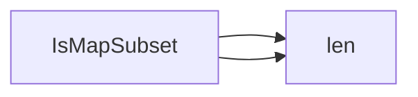

## Package datautil (github.com/redhat-best-practices-for-k8s/certsuite/internal/datautil)

### Functions

- **IsMapSubset** — func(map[K]V, map[K]V)(bool)

### Call graph (exported symbols, partial)

### Symbol docs

- [function IsMapSubset](symbols/function_IsMapSubset.md)
