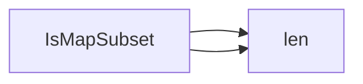

## Package datautil (github.com/redhat-best-practices-for-k8s/certsuite/internal/datautil)

# Package Overview – `datautil`

| Category | Details |
|----------|---------|
| **Path** | `github.com/redhat-best-practices-for-k8s/certsuite/internal/datautil` |
| **Purpose** | Utility helpers that operate on Go data structures (currently only maps). |
| **Files** | 1 (`data_util.go`) |

---

## Core Functionality

### `IsMapSubset[K comparable, V any](a, b map[K]V) bool`

* **Signature**  
  ```go
  func IsMapSubset(a, b map[K]V) bool
  ```
  *Generics:* `<K comparable, V any>` – the key type must be comparable (required for map keys).

* **Behavior**  
  Determines whether every entry in `b` exists in `a` with an equal value. In other words, it checks if `b` is a *subset* of `a`.

* **Implementation Highlights**
  ```go
  func IsMapSubset[K comparable, V any](a, b map[K]V) bool {
      // Quick fail if the candidate subset is larger.
      if len(b) > len(a) { return false }
  
      for k, v := range b {
          av, ok := a[k]
          if !ok || av != v {
              return false
          }
      }
      return true
  }
  ```
  * Uses the built‑in `len` twice to compare sizes before iterating.
  * Iterates over `b`; for each key it looks up the value in `a`.
  * Returns `false` on first mismatch, otherwise `true`.

* **Use Cases**
  - Validating configuration overrides: ensure an override map only contains keys that exist in the base config.
  - Testing data integrity: confirm a snapshot of selected fields matches expectations.

---

## How It Connects

```
┌─────────────────────┐
│ IsMapSubset(a, b)   │
├───────────▲──────────┤
│           │          │
│   (a)     │          │
│  map[K]V  │          │
│           │          │
│   (b)     │          │
│  map[K]V  │          │
└───────────┴──────────┘
```

* **Input** – two maps (`a` and `b`).  
* **Processing** – size check → element‑by‑element comparison.  
* **Output** – a boolean indicating subset relationship.

---

## Summary

The `datautil` package is minimal but useful: it provides a single generic helper that checks whether one map is a subset of another, with early exit optimizations. No global state or additional data structures are involved. This function can be reused across the certsuite codebase wherever such a comparison is required.

### Functions

- **IsMapSubset** — func(map[K]V, map[K]V)(bool)

### Call graph (exported symbols, partial)



### Symbol docs

- [function IsMapSubset](symbols/function_IsMapSubset.md)
