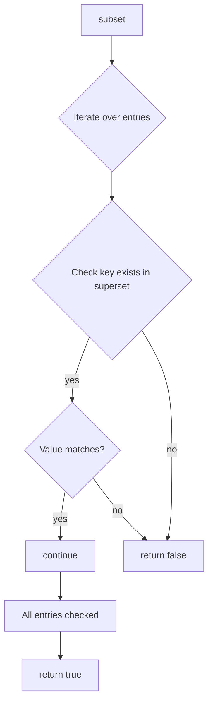

IsMapSubset`

| Aspect | Details |
|--------|---------|
| **Package** | `github.com/redhat-best-practices-for-k8s/certsuite/internal/datautil` |
| **Exported?** | Yes (`func IsMapSubset`) |
| **Signature** | `func IsMapSubset[K comparable, V any](subset, superset map[K]V) bool` |

### Purpose
Determines whether every key/value pair in the first map (`subset`) appears identically in the second map (`superset`).  
It is a strict subset test: if *any* entry of `subset` does not exist in `superset`, or the value differs, the function returns `false`.

### Inputs

| Parameter | Type | Description |
|-----------|------|-------------|
| `subset`  | `map[K]V` | Candidate subset map. Keys must be comparable. |
| `superset`| `map[K]V` | Map to test against. |

Both maps use generic type parameters (`K`, `V`) so the function works for any comparable key and any value type.

### Output

- `bool`:  
  - `true` if every key/value pair in `subset` is present in `superset`.  
  - `false` otherwise.

### Key Dependencies
* Uses the built‑in `len()` twice:
  * To quickly reject when `subset` is longer than `superset`.
  * As a simple guard before iterating, though not strictly necessary for correctness.
* Relies on map iteration semantics in Go (order‑independent).

### Side Effects
None. The function only reads the maps; it does not modify either argument.

### Package Context
The `datautil` package provides small utility helpers used throughout *certsuite*.  
`IsMapSubset` is a foundational helper that other code can use to validate configuration or state relationships, e.g., ensuring that required keys are present in a larger set of data.  

This diagram illustrates the decision flow: iterate through `subset`, verify each key/value pair in `superset`; if any mismatch occurs, return `false`; otherwise return `true` after all checks.
