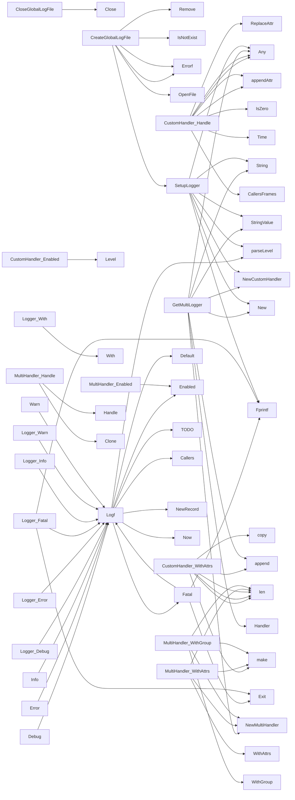

## Package log (github.com/redhat-best-practices-for-k8s/certsuite/internal/log)

### Structs

- **CustomHandler** (exported) — 4 fields, 5 methods
- **Logger** (exported) — 1 fields, 6 methods
- **MultiHandler** (exported) — 1 fields, 4 methods

### Functions

- **CloseGlobalLogFile** — func()(error)
- **CreateGlobalLogFile** — func(string, string)(error)
- **CustomHandler.Enabled** — func(context.Context, slog.Level)(bool)
- **CustomHandler.Handle** — func(context.Context, slog.Record)(error)
- **CustomHandler.WithAttrs** — func([]slog.Attr)(slog.Handler)
- **CustomHandler.WithGroup** — func(string)(slog.Handler)
- **Debug** — func(string, ...any)()
- **Error** — func(string, ...any)()
- **Fatal** — func(string, ...any)()
- **GetLogger** — func()(*Logger)
- **GetMultiLogger** — func(...io.Writer)(*Logger)
- **Info** — func(string, ...any)()
- **Logf** — func(*Logger, string, string, ...any)()
- **Logger.Debug** — func(string, ...any)()
- **Logger.Error** — func(string, ...any)()
- **Logger.Fatal** — func(string, ...any)()
- **Logger.Info** — func(string, ...any)()
- **Logger.Warn** — func(string, ...any)()
- **Logger.With** — func(...any)(*Logger)
- **MultiHandler.Enabled** — func(context.Context, slog.Level)(bool)
- **MultiHandler.Handle** — func(context.Context, slog.Record)(error)
- **MultiHandler.WithAttrs** — func([]slog.Attr)(slog.Handler)
- **MultiHandler.WithGroup** — func(string)(slog.Handler)
- **NewCustomHandler** — func(io.Writer, *slog.HandlerOptions)(*CustomHandler)
- **NewMultiHandler** — func(...slog.Handler)(*MultiHandler)
- **SetLogger** — func(*Logger)()
- **SetupLogger** — func(io.Writer, string)()
- **Warn** — func(string, ...any)()

### Globals

- **CustomLevelNames**: 

### Call graph (exported symbols, partial)

### Symbol docs

- [struct CustomHandler](symbols/struct_CustomHandler.md)
- [struct Logger](symbols/struct_Logger.md)
- [struct MultiHandler](symbols/struct_MultiHandler.md)
- [function CloseGlobalLogFile](symbols/function_CloseGlobalLogFile.md)
- [function CreateGlobalLogFile](symbols/function_CreateGlobalLogFile.md)
- [function CustomHandler.Enabled](symbols/function_CustomHandler_Enabled.md)
- [function CustomHandler.Handle](symbols/function_CustomHandler_Handle.md)
- [function CustomHandler.WithAttrs](symbols/function_CustomHandler_WithAttrs.md)
- [function CustomHandler.WithGroup](symbols/function_CustomHandler_WithGroup.md)
- [function Debug](symbols/function_Debug.md)
- [function Error](symbols/function_Error.md)
- [function Fatal](symbols/function_Fatal.md)
- [function GetLogger](symbols/function_GetLogger.md)
- [function GetMultiLogger](symbols/function_GetMultiLogger.md)
- [function Info](symbols/function_Info.md)
- [function Logf](symbols/function_Logf.md)
- [function Logger.Debug](symbols/function_Logger_Debug.md)
- [function Logger.Error](symbols/function_Logger_Error.md)
- [function Logger.Fatal](symbols/function_Logger_Fatal.md)
- [function Logger.Info](symbols/function_Logger_Info.md)
- [function Logger.Warn](symbols/function_Logger_Warn.md)
- [function Logger.With](symbols/function_Logger_With.md)
- [function MultiHandler.Enabled](symbols/function_MultiHandler_Enabled.md)
- [function MultiHandler.Handle](symbols/function_MultiHandler_Handle.md)
- [function MultiHandler.WithAttrs](symbols/function_MultiHandler_WithAttrs.md)
- [function MultiHandler.WithGroup](symbols/function_MultiHandler_WithGroup.md)
- [function NewCustomHandler](symbols/function_NewCustomHandler.md)
- [function NewMultiHandler](symbols/function_NewMultiHandler.md)
- [function SetLogger](symbols/function_SetLogger.md)
- [function SetupLogger](symbols/function_SetupLogger.md)
- [function Warn](symbols/function_Warn.md)
