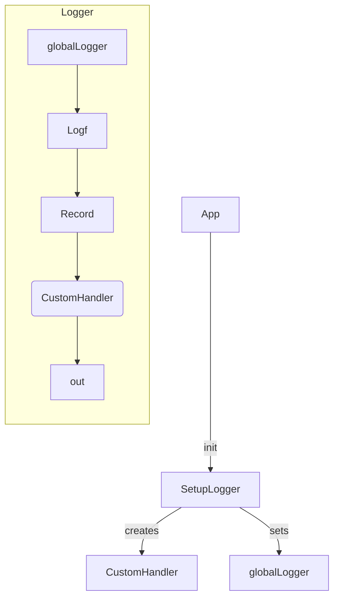
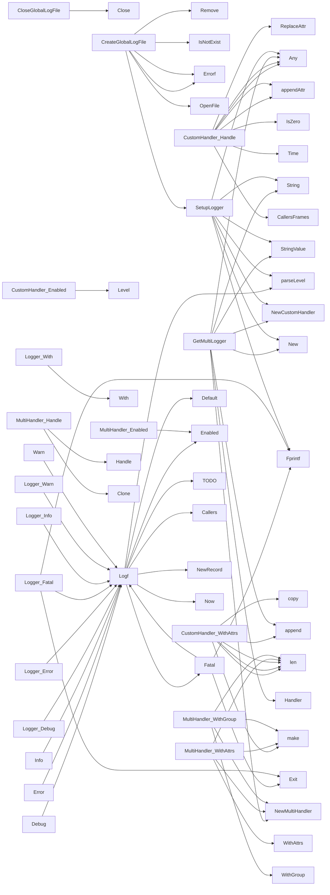

## Package log (github.com/redhat-best-practices-for-k8s/certsuite/internal/log)

# Package Overview – `github.com/redhat-best-practices-for-k8s/certsuite/internal/log`

The **log** package implements a lightweight, structured logger built on top of the standard library’s [`slog`](https://pkg.go.dev/log/slog) package.  
It exposes:

* a global singleton logger (`globalLogger`) that can be reused by the rest of the application,
* convenience wrappers for the usual log levels (`Debug`, `Info`, …),
* custom handler types to format logs in a human‑friendly form and to write them to one or more destinations.

Below we walk through the key data structures, globals, helper functions and how they interoperate.

---

## 1. Global state

| Variable | Type | Purpose |
|----------|------|---------|
| `globalLogFile` | `*os.File` | File descriptor for a log file created by `CreateGlobalLogFile`. It is closed by `CloseGlobalLogFile`. |
| `globalLogLevel` | `slog.Level` | Current minimum level for the global logger. Set in `SetupLogger`. |
| `globalLogger` | `*Logger` | Singleton logger instance returned by `GetLogger`. All top‑level log functions (`Debug`, `Info`, …) forward to this object. |

The package also defines constants for standard levels (e.g., `LevelDebug`) and a custom level `CustomLevelFatal`.

---

## 2. Public types

### 2.1 `Logger`

```go
type Logger struct {
    l *slog.Logger
}
```

*Wraps the underlying `*slog.Logger` to expose methods that keep the source location correct.*

| Method | Description |
|--------|-------------|
| `Debug`, `Info`, `Warn`, `Error`, `Fatal` | Log a message at the given level. Internally call `Logf`. |
| `With(...any)` | Returns a new `*Logger` with additional attributes, delegating to the wrapped logger’s `With`. |

The convenience top‑level functions (`Debug`, `Info`, …) simply invoke these methods on the global singleton.

### 2.2 `CustomHandler`

A custom implementation of `slog.Handler` that writes log lines in a compact format:

```
LOG_LEVEL [TIME] [SOURCE_FILE] [CUSTOM_ATTRS] MSG
```

Fields:

| Field | Type | Notes |
|-------|------|-------|
| `attrs []slog.Attr` | Attributes to prepend to every record. |
| `mu *sync.Mutex` | Protects concurrent writes. |
| `opts slog.HandlerOptions` | Configuration (e.g., level). |
| `out io.Writer` | Destination (file or stdout). |

Key methods:

* `Enabled(ctx, lvl)` – checks the handler’s level.
* `Handle(ctx, r)` – builds a formatted string by iterating over record attributes and writing it to `out`. Uses `appendAttr` to serialize each attribute.
* `WithAttrs(attrs)` – returns a new handler with additional attributes appended.  
  *`WithGroup` is unimplemented; it simply returns the same handler.*

The helper `NewCustomHandler(out io.Writer, opts *slog.HandlerOptions) *CustomHandler` constructs an instance.

### 2.3 `MultiHandler`

Allows writing to multiple destinations by composing several `slog.Handler`s.

```go
type MultiHandler struct {
    handlers []slog.Handler
}
```

* `Enabled(ctx, lvl)` – true if all sub‑handlers are enabled.
* `Handle(ctx, r)` – clones the record and forwards it to each handler.  
  Cloning is necessary because a single `Record` can only be consumed once.
* `WithAttrs(attrs)`, `WithGroup(name)` – create new `MultiHandler`s that propagate the attributes/grouping to all underlying handlers.

Construction: `NewMultiHandler(h1, h2, ...) *MultiHandler`.

---

## 3. Core helpers

| Function | Purpose |
|----------|---------|
| `SetupLogger(out io.Writer, level string)` | Parses a textual log level, creates a `CustomHandler`, and sets the global logger (`globalLogger`). Also writes the chosen level to the output (useful for debugging). |
| `CreateGlobalLogFile(dir, name string) error` | Ensures the directory exists, opens/creates the log file, assigns it to `globalLogFile`, then calls `SetupLogger`. |
| `CloseGlobalLogFile() error` | Closes `globalLogFile`. |
| `GetLogger() *Logger` | Returns the singleton logger. If it hasn’t been set yet, it defaults to a console logger at level `LevelInfo`. |
| `SetLogger(l *Logger) func()` | Replaces the global logger with `l`; returns a function that restores the previous logger (useful for tests). |
| `GetMultiLogger(writers ...io.Writer) *Logger` | Creates a `CustomHandler` for each writer, combines them via `NewMultiHandler`, and wraps it in a `Logger`. |

---

## 4. Logging workflow

1. **Initialization**  
   *Application* calls `CreateGlobalLogFile(dir, name)` or directly `SetupLogger(out, level)`.  
   This creates the underlying handler(s), assigns them to `globalLogger`, and sets `globalLogLevel`.

2. **Logging**  
   Calls to top‑level helpers (`Debug("msg")`, `Info(fmt.Sprintf(...))`, etc.) are compiled into calls to the corresponding method on `globalLogger`.  
   The method in turn invokes `Logf` with a level string.

3. **Formatting & output**  
   `Logf` builds an `slog.Record` (with time, source file, message, and any attributes), then passes it to the handler chain (`CustomHandler` → writes to `out`).  
   The handler serializes each attribute via `appendAttr`, producing a single line per log entry.

4. **Multiple destinations**  
   If multiple writers are desired, use `GetMultiLogger(w1, w2)`; this returns a logger whose handler is a `MultiHandler` that forwards the same record to all underlying `CustomHandler`s.

---

## 5. Mermaid diagram (suggestion)



---

## 6. Notes & Edge Cases

* **Custom level `Fatal`** – The package defines a custom log level (`CustomLevelFatal`) that is not part of the standard `slog.Level` set. It’s used only in formatting (via `CustomHandler.appendAttr`).  
* **Group handling** – `WithGroup` on both handlers returns the same instance; grouping attributes are effectively ignored.
* **Thread safety** – `CustomHandler.mu` protects writes to the underlying writer, while `MultiHandler.Handle` clones records before forwarding, avoiding data races.
* **Missing globals in calls** – The function call lists do not show usage of some globals (`globalLogLevel`) directly; they’re set during initialization and read only by handlers.

---

### Summary

The `log` package provides a small but fully‑featured logging facility that:

1. Wraps Go’s `slog` for structured output,
2. Formats logs into human‑readable lines with level, time, source file, custom attributes and message,
3. Supports writing to multiple destinations via a multi‑handler,
4. Exposes a global singleton logger with convenient top‑level wrappers.

This design keeps logging simple while giving callers the flexibility to route logs to files or other writers as needed.

### Structs

- **CustomHandler** (exported) — 4 fields, 5 methods
- **Logger** (exported) — 1 fields, 6 methods
- **MultiHandler** (exported) — 1 fields, 4 methods

### Functions

- **CloseGlobalLogFile** — func()(error)
- **CreateGlobalLogFile** — func(string, string)(error)
- **CustomHandler.Enabled** — func(context.Context, slog.Level)(bool)
- **CustomHandler.Handle** — func(context.Context, slog.Record)(error)
- **CustomHandler.WithAttrs** — func([]slog.Attr)(slog.Handler)
- **CustomHandler.WithGroup** — func(string)(slog.Handler)
- **Debug** — func(string, ...any)()
- **Error** — func(string, ...any)()
- **Fatal** — func(string, ...any)()
- **GetLogger** — func()(*Logger)
- **GetMultiLogger** — func(...io.Writer)(*Logger)
- **Info** — func(string, ...any)()
- **Logf** — func(*Logger, string, string, ...any)()
- **Logger.Debug** — func(string, ...any)()
- **Logger.Error** — func(string, ...any)()
- **Logger.Fatal** — func(string, ...any)()
- **Logger.Info** — func(string, ...any)()
- **Logger.Warn** — func(string, ...any)()
- **Logger.With** — func(...any)(*Logger)
- **MultiHandler.Enabled** — func(context.Context, slog.Level)(bool)
- **MultiHandler.Handle** — func(context.Context, slog.Record)(error)
- **MultiHandler.WithAttrs** — func([]slog.Attr)(slog.Handler)
- **MultiHandler.WithGroup** — func(string)(slog.Handler)
- **NewCustomHandler** — func(io.Writer, *slog.HandlerOptions)(*CustomHandler)
- **NewMultiHandler** — func(...slog.Handler)(*MultiHandler)
- **SetLogger** — func(*Logger)()
- **SetupLogger** — func(io.Writer, string)()
- **Warn** — func(string, ...any)()

### Globals

- **CustomLevelNames**: 

### Call graph (exported symbols, partial)



### Symbol docs

- [struct CustomHandler](symbols/struct_CustomHandler.md)
- [struct Logger](symbols/struct_Logger.md)
- [struct MultiHandler](symbols/struct_MultiHandler.md)
- [function CloseGlobalLogFile](symbols/function_CloseGlobalLogFile.md)
- [function CreateGlobalLogFile](symbols/function_CreateGlobalLogFile.md)
- [function CustomHandler.Enabled](symbols/function_CustomHandler_Enabled.md)
- [function CustomHandler.Handle](symbols/function_CustomHandler_Handle.md)
- [function CustomHandler.WithAttrs](symbols/function_CustomHandler_WithAttrs.md)
- [function CustomHandler.WithGroup](symbols/function_CustomHandler_WithGroup.md)
- [function Debug](symbols/function_Debug.md)
- [function Error](symbols/function_Error.md)
- [function Fatal](symbols/function_Fatal.md)
- [function GetLogger](symbols/function_GetLogger.md)
- [function GetMultiLogger](symbols/function_GetMultiLogger.md)
- [function Info](symbols/function_Info.md)
- [function Logf](symbols/function_Logf.md)
- [function Logger.Debug](symbols/function_Logger_Debug.md)
- [function Logger.Error](symbols/function_Logger_Error.md)
- [function Logger.Fatal](symbols/function_Logger_Fatal.md)
- [function Logger.Info](symbols/function_Logger_Info.md)
- [function Logger.Warn](symbols/function_Logger_Warn.md)
- [function Logger.With](symbols/function_Logger_With.md)
- [function MultiHandler.Enabled](symbols/function_MultiHandler_Enabled.md)
- [function MultiHandler.Handle](symbols/function_MultiHandler_Handle.md)
- [function MultiHandler.WithAttrs](symbols/function_MultiHandler_WithAttrs.md)
- [function MultiHandler.WithGroup](symbols/function_MultiHandler_WithGroup.md)
- [function NewCustomHandler](symbols/function_NewCustomHandler.md)
- [function NewMultiHandler](symbols/function_NewMultiHandler.md)
- [function SetLogger](symbols/function_SetLogger.md)
- [function SetupLogger](symbols/function_SetupLogger.md)
- [function Warn](symbols/function_Warn.md)
