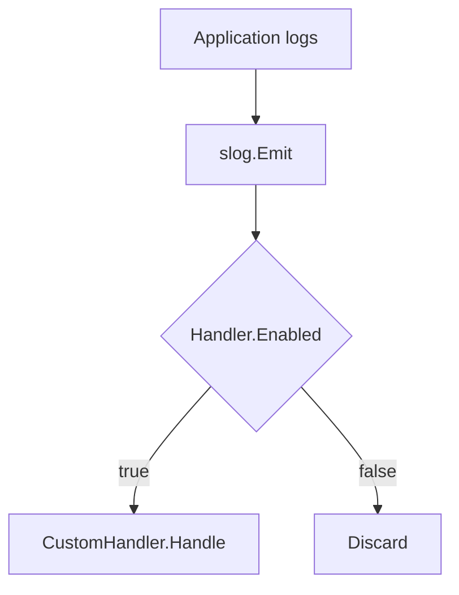

CustomHandler.Enabled`

**File:** `internal/log/custom_handler.go` – line 40  
**Package:** `log`

### Purpose
`Enabled` determines whether a log record of a given level should be processed by the custom handler.  
The method implements the `slog.Handler` interface required for any custom logger in Go’s standard logging package (`log/slog`). It is called automatically by the slog framework whenever a log message is emitted.

### Signature
```go
func (h CustomHandler) Enabled(ctx context.Context, level slog.Level) bool
```

| Parameter | Type          | Description |
|-----------|---------------|-------------|
| `ctx`     | `context.Context` | Unused in this implementation but part of the interface. It allows future extensions to use request‑scoped information for filtering. |
| `level`   | `slog.Level` | The severity level of the log record that is about to be emitted. |

**Return value**

- `bool`:  
  *`true`* if the handler should emit the message, *false* otherwise.

### Key Dependency
The method delegates the actual decision to the helper function **`Level(level)`**, which maps a numeric `slog.Level` into an internal enum defined by the package. The mapping logic is not shown here but typically translates between slog’s standard levels (`Debug`, `Info`, `Warn`, `Error`, `Fatal`) and any custom levels that the project defines.

### Side‑Effects
None.  
The method only evaluates a condition; it does not modify global state or produce output.

### Interaction with Package State

| Global / Constant | Role in this function |
|-------------------|-----------------------|
| `globalLogLevel`  | (not referenced directly) The handler would normally compare the incoming level against the configured log level to decide whether to enable logging. In this implementation, that logic is hidden inside the `Level()` helper. |
| `CustomLevelNames` | Not used here but defines names for custom levels; likely used elsewhere in the package. |

### How It Fits Into the Package
- **Handler Interface**: `Enabled` is one of three required methods (`Enabled`, `Handle`, and `WithAttrs/WithGroup`) that allow a type to act as an `slog.Handler`.  
- **Custom Logging**: The `log` package exposes a global logger (`globalLogger`) which internally uses a `CustomHandler`. When application code logs via this global logger, slog will call `Enabled` for each message to determine if it should be processed.  
- **Extensibility**: By keeping the logic in a helper function (`Level()`), the project can centralize level‑to‑enum mapping and easily add new custom levels without touching the handler.

### Suggested Mermaid Diagram


This diagram shows that the `Enabled` method gates whether a log message reaches the handler’s `Handle` routine.
