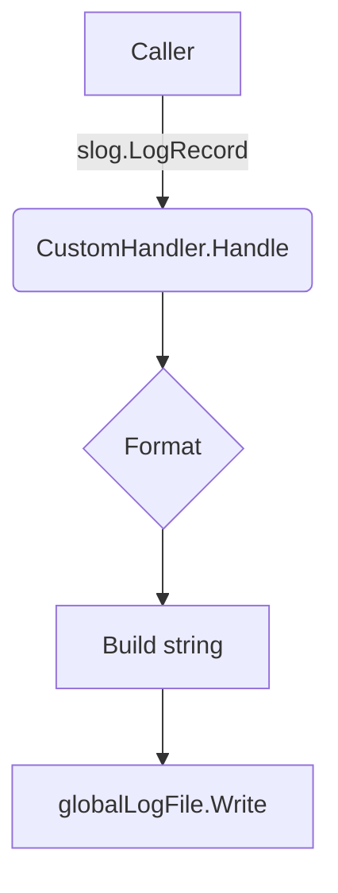

CustomHandler.Handle`

| Aspect | Detail |
|--------|--------|
| **Signature** | `func (h CustomHandler) Handle(ctx context.Context, r slog.Record) error` |
| **Exported** | Yes – it implements the `slog.Handler` interface. |

### Purpose

The `Handle` method formats and writes a single log record to the package‑wide global log file (`globalLogFile`).  
It produces a line in the form:

```
LOG_LEVEL [TIME] [SOURCE_FILE] [CUSTOM_ATTRS] MSG
```

* **LOG_LEVEL** – human‑readable level name (e.g. `INFO`, `ERROR`) taken from `CustomLevelNames` or the standard slog level string.
* **TIME** – timestamp of the record formatted with RFC3339Nano.
* **SOURCE_FILE** – file and line number where the log call originated, derived from `runtime.CallersFrames`.
* **CUSTOM_ATTRS** – any attributes attached to the record that are not part of the standard set (`time`, `source`).
* **MSG** – the main message string of the record.

### Inputs

| Parameter | Type | Description |
|-----------|------|-------------|
| `ctx` | `context.Context` | Context passed by slog; currently unused but kept for interface compatibility. |
| `r` | `slog.Record` | The log entry to format and write. It contains the level, time, message, and an attribute iterator (`Attrs`) that may hold custom key/value pairs. |

### Output

* Returns an `error`.  
  * On success it returns `nil`.  
  * If writing to the global file fails, the underlying `os.File.Write` error is returned.

### Key Dependencies & Calls

| Call | Purpose |
|------|---------|
| `ReplaceAttr` | Removes standard attributes (`time`, `source`) from the record so they can be inserted explicitly. |
| `Any`, `String`, `Time`, `Sprintf`, `Base` | Helper functions to build attribute values and format strings. |
| `appendAttr` (internal helper) | Builds a slice of key/value pairs for custom attributes. |
| `IsZero` | Checks if an attribute value is zero‑value; such attributes are omitted. |
| `CallersFrames`, `Next` | Resolve the call stack to determine source file/line. |
| `Lock` / `Unlock` | Serialise writes to `globalLogFile`. |
| `Write` | Performs the actual I/O operation. |

### Side Effects

* **Thread‑safety** – Uses a mutex (`h.mu`) to guard concurrent writes.
* **Global state mutation** – None; it only reads from `globalLogFile`.
* **Context handling** – The context is ignored; no cancellation or deadline logic is performed.

### How It Fits the Package

The `log` package provides a lightweight logging façade.  
`CustomHandler` is a private type that implements `slog.Handler`.  
When `NewLogger()` (not shown) creates an `*os.File` and assigns it to `globalLogFile`, it also registers an instance of `CustomHandler` with the root slog logger:

```go
slog.SetDefault(slog.New(CustomHandler{mu: &sync.Mutex{}}))
```

All log calls (`slog.Info`, `slog.Error`, etc.) are routed through this handler, ensuring a consistent format across the application. The handler’s design isolates formatting logic from the rest of the codebase, allowing future changes (e.g., JSON output) without touching business logic.

---

#### Suggested Mermaid Diagram



This diagram illustrates the flow from a log call to the formatted write.
