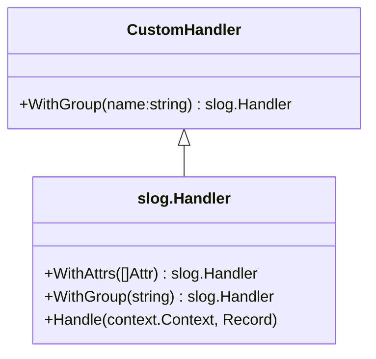

CustomHandler.WithGroup`

```go
func (h CustomHandler) WithGroup(name string) slog.Handler
```

### Purpose
`WithGroup` is part of the `slog.Handler` interface required by Go’s structured logging system.  
In this project it is intentionally left **unimplemented** and simply returns a *nil* handler. The method exists solely to satisfy the compiler when a `CustomHandler` value is used as an `slog.Handler`.  

### Parameters
| Name | Type   | Description |
|------|--------|-------------|
| `name` | `string` | The name of the group that would normally be added to log records. |

> **Note**: The parameter is unused in this stub implementation.

### Return Value
- Returns a value of type `slog.Handler`.  
  In the current code it always returns `nil`, which effectively disables grouping for this handler.

### Dependencies & Side‑Effects
| Dependency | Impact |
|------------|--------|
| None (apart from the method’s signature) | No side effects – the function does not modify any state or global variables. |

### How It Fits the Package
* The package `internal/log` implements a custom logging subsystem built on top of Go’s standard `slog`.  
* `CustomHandler` is the concrete type that wraps an underlying `slog.Handler` and adds support for custom log levels (`CustomLevelFatal`, etc.).  
* To be usable as an `slog.Handler`, it must implement all methods of the interface, including `WithGroup`.  
* The current implementation is a placeholder; once grouping functionality is required, this method would need to return a new handler that prefixes record keys with the provided group name.

### Suggested Mermaid Diagram



The diagram shows `CustomHandler` as a concrete implementation of the `slog.Handler` interface. The stubbed `WithGroup` method is highlighted to indicate that grouping logic is currently absent.

---
