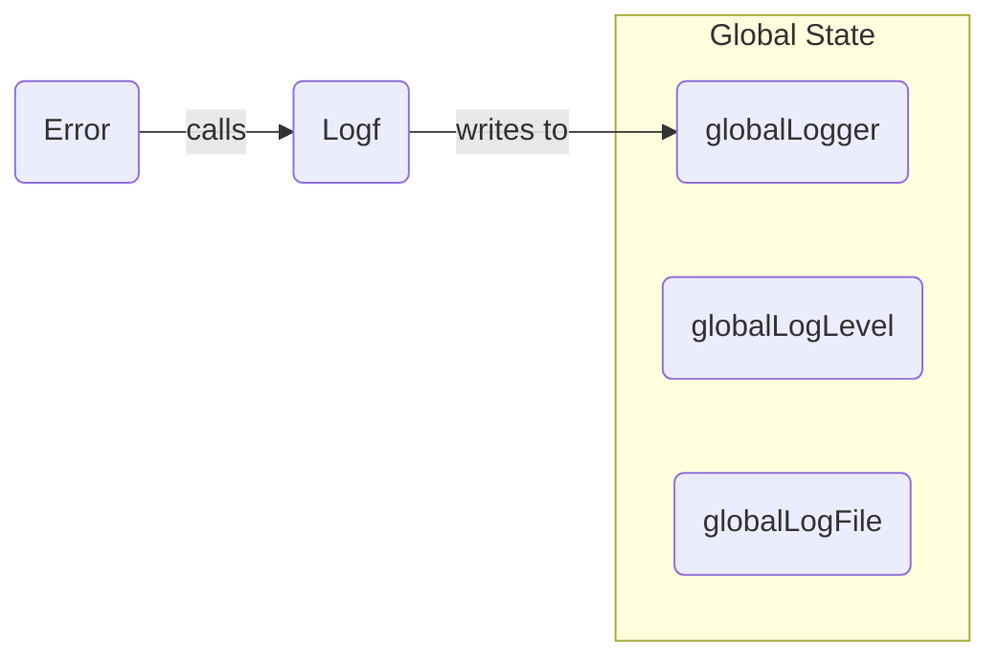

Error` – Convenience wrapper around the global logger

### Purpose
`Error` is a helper that logs an error‑level message using the package’s *global* logger and then returns a zero value closure (`func()`).  
It is intended for quick one‑liner error reporting where the caller doesn’t need to keep a reference to the logger.

```go
func Error(msg string, args ...any) func()
```

### Parameters

| Parameter | Type  | Description |
|-----------|-------|-------------|
| `msg`     | `string` | The message template passed to `Logf`. |
| `args...` | `…any`   | Optional formatting arguments for the message. |

> **Note**: The function accepts a variadic list of values so that callers can use `fmt.Sprintf`‑style formatting.

### Return value

- A zero‑value closure (`func()`) – typically ignored by the caller.  
  Returning a no‑op function keeps the API compatible with other logging helpers in the package that return callbacks (e.g., for deferred cleanup).

### Key dependencies

| Dependency | Role |
|------------|------|
| `Logf` | The underlying implementation that writes the formatted message to the global logger. |
| `globalLogger` | Holds the active `*slog.Logger` instance used by `Logf`. |

The function itself does not modify any global state; it only delegates to `Logf`.

### Side effects

- Calls `Logf(LevelError, msg, args...)`, which writes a log entry at **error** severity.
- No other side effects occur (no file I/O, no state mutation).

### How it fits the package

The `log` package exposes a set of level‑specific helpers (`Debug`, `Info`, `Warn`, `Fatal`) that all wrap `Logf`.  
`Error` follows this pattern:

```go
func Error(msg string, args ...any) func() {
    return Logf(LevelError, msg, args...)
}
```

It is used throughout the codebase wherever a quick error log is needed without caring about logger configuration.  

---

#### Suggested Mermaid diagram



This diagram shows that `Error` delegates to `Logf`, which writes the message to the global logger.
