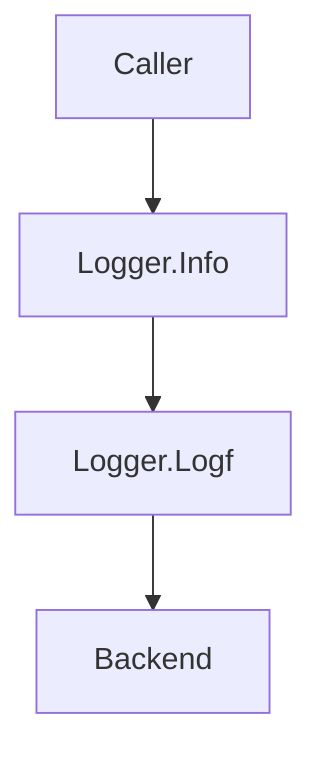

Logger.Info`

| Aspect | Detail |
|--------|--------|
| **Package** | `github.com/redhat-best-practices-for-k8s/certsuite/internal/log` |
| **Exported** | Yes (`Info`) |
| **Receiver type** | `*Logger` |
| **Signature** | `func (l *Logger) Info(msg string, args ...any)` |

### Purpose
`Logger.Info` is a convenience wrapper that logs an informational message.  
It forwards the call to the underlying logger’s `Logf` method with the `LevelInfo` level.

### Parameters
- `msg string`: The format string (may contain `%` verbs) for the log entry.
- `args ...any`: Optional arguments that will be formatted into `msg`.

### Return value
None. The function is fire‑and‑forget; it only writes to the configured log destination.

### Key Dependencies & Calls
| Dependency | Role |
|------------|------|
| `l.Logf` | The core logging routine that actually records the entry. It receives the level, message, and arguments. |
| `LevelInfo` (constant) | The severity level passed to `Logf`. |

The method simply delegates:

```go
func (l *Logger) Info(msg string, args ...any) {
    l.Logf(LevelInfo, msg, args...)
}
```

### Side Effects & Global Interaction
- **No global state mutation**: `Info` does not modify any of the package globals (`globalLogFile`, `globalLogLevel`, `globalLogger`).  
- **Output**: The log entry is written to whatever backend the `*Logger` instance is configured with (file, console, etc.).  

### How It Fits in the Package
The `log` package defines a lightweight wrapper around Go’s standard `slog`.  
It exposes several convenience methods (`Debug`, `Info`, `Warn`, `Error`, `Fatal`) that internally call `Logf` with the appropriate severity.  
`Logger.Info` is part of this public API, allowing callers to log at the informational level without needing to reference `LevelInfo` directly.



> **Note**: The actual logging logic (file creation, formatting, etc.) resides in `Logger.Logf`.  
> `Logger.Info` is purely syntactic sugar for a common use case.
