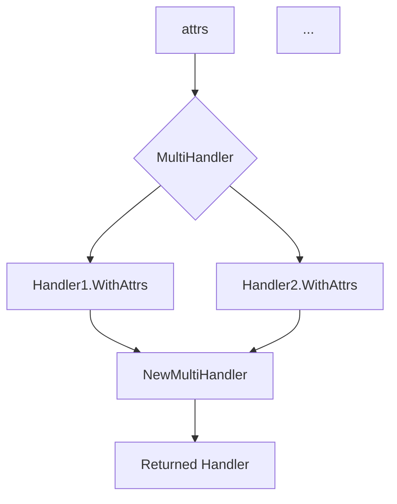

MultiHandler.WithAttrs`

| Aspect | Details |
|--------|---------|
| **Receiver** | `mh MultiHandler` – a handler that aggregates multiple underlying `slog.Handler`s. |
| **Signature** | `func (mh MultiHandler) WithAttrs(attrs []slog.Attr) slog.Handler` |
| **Package** | `github.com/redhat-best-practices-for-k8s/certsuite/internal/log` |

#### Purpose
`WithAttrs` creates a new `slog.Handler` that augments every log record emitted through it with the supplied attributes.  
The method is part of the *adapter* pattern used by the package to allow an arbitrary number of handlers (e.g., console, file, custom) to receive the same enriched log records.

#### How It Works
1. **Attribute Accumulation** – For each underlying handler in `mh` the method calls that handler’s own `WithAttrs(attrs)` to obtain a wrapped version that already knows how to inject the supplied attributes.
2. **Re‑aggregation** – The resulting slice of wrapped handlers is passed to `NewMultiHandler`, which constructs a new `MultiHandler` instance containing only those wrapped handlers.

#### Inputs
- `attrs []slog.Attr`: A slice of slog attributes (key/value pairs) that should be attached to every log record produced by the returned handler.

#### Output
- `slog.Handler`: A new handler that, when called, forwards records to all original handlers with the additional attributes applied.

#### Key Dependencies
| Dependency | Role |
|------------|------|
| `make` | Creates a slice to hold the wrapped handlers. |
| `len`  | Determines how many underlying handlers exist. |
| `WithAttrs` (on each inner handler) | Produces the attribute‑augmented version of that handler. |
| `NewMultiHandler` | Combines the augmented handlers back into a single multi‑handler instance. |

#### Side Effects
- **No global state mutation** – The function only creates new handler objects; it does not alter package globals or file descriptors.
- **Immutability guarantee** – The original `MultiHandler` and its inner handlers remain unchanged.

#### Role in the Package
The `log` package provides a flexible logging framework that can output to multiple destinations (console, file, custom loggers).  
`MultiHandler.WithAttrs` is essential for:
- Propagating contextual information (e.g., request IDs, user IDs) across all outputs without duplicating logic.
- Enabling higher‑level code to attach attributes once and have them automatically applied to every handler in the chain.

#### Suggested Mermaid Diagram

This diagram illustrates that the attribute slice is distributed to each child handler, wrapped individually, and then re‑assembled into a new `MultiHandler`.
