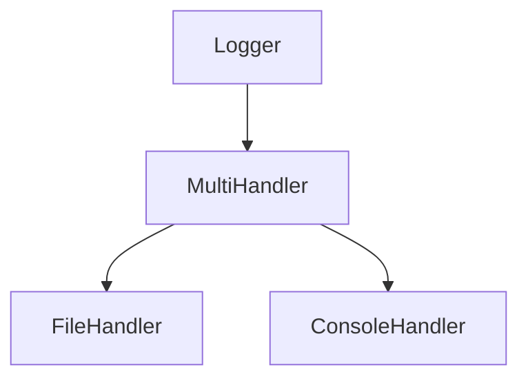

NewMultiHandler`

### Purpose
`NewMultiHandler` constructs a **multi‑handler** that forwards log records to several underlying handlers at once.  
In the `log` package this is used when a single logical logger must write to multiple destinations (e.g., console and file) without duplicating formatting logic.

### Signature
```go
func NewMultiHandler(...slog.Handler) *MultiHandler
```

| Parameter | Type            | Description |
|-----------|-----------------|-------------|
| `...slog.Handler` | variadic slice of `slog.Handler` | The child handlers that will receive each log record. |

| Return | Type          | Description |
|--------|---------------|-------------|
| `*MultiHandler` | pointer to a new `MultiHandler` struct | A handler capable of dispatching records to all supplied children. |

### Key Dependencies
- **`slog.Handler`** – the standard Go 1.21 logging interface that every child must satisfy.
- **`MultiHandler`** (defined in `multi_handler.go`) – holds an internal slice of handlers and implements the `slog.Handler` interface itself.

No global variables are accessed or modified; the function is pure from a package‑level perspective.

### Side Effects
None. The function merely allocates a new struct and stores the provided handlers. It does not open files, write logs, or alter any shared state.

### How it fits in the package
The `log` package offers several specialized handlers:
- `custom_handler.go`: defines custom log levels.
- `file_handler.go`: writes to a file (`globalLogFile`, `globalLogLevel`).
- `console_handler.go`: writes to standard output.

`NewMultiHandler` is typically used in the package’s initialization logic (e.g., `SetupLogger`) to combine these into one logical logger that satisfies all downstream consumers.  
Example usage:

```go
fileH := NewFileHandler("app.log", LevelInfo)
consoleH := NewConsoleHandler(LevelDebug)

multi := NewMultiHandler(fileH, consoleH)
logger := slog.New(multi)
```

### Suggested Mermaid Diagram



This diagram shows the `Logger` delegating to a `MultiHandler`, which in turn forwards log records to both a file and console handler.
