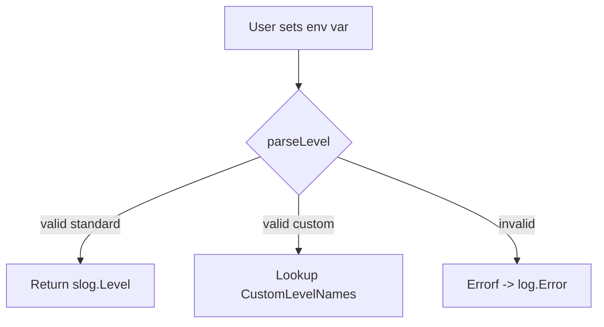

parseLevel`

```go
func parseLevel(s string) (slog.Level, error)
```

### Purpose

`parseLevel` converts a textual representation of a log level into the corresponding
[`slog.Level`](https://pkg.go.dev/go.opentelemetry.io/otel/sdk/log/slog#Level) value used by the package’s internal logger.  
It is an internal helper called when configuring logging from a string (e.g., via environment variables or CLI flags).

### Inputs

| Param | Type   | Description |
|-------|--------|-------------|
| `s`   | `string` | The raw log level name, case‑insensitive (`"debug"`, `"info"`, `"warn"`, `"error"`, `"fatal"`). Custom levels are also supported through the `CustomLevelNames` map defined in *custom_handler.go*. |

### Outputs

| Return | Type          | Description |
|--------|---------------|-------------|
| `slog.Level` | The matching level constant (`LevelDebug`, `LevelInfo`, etc.). |
| `error` | Non‑nil if the string does not match any known level. The error is produced with `Errorf`. |

### Key Logic

1. **Normalization** – The input string is converted to lower case using `strings.ToLower`.
2. **Lookup** – A switch (or map) matches the normalized name against the exported constants:
   - `"debug"` → `LevelDebug`
   - `"info"`  → `LevelInfo`
   - `"warn"`  → `LevelWarn`
   - `"error"` → `LevelError`
   - `"fatal"` → `LevelFatal`
3. **Custom Levels** – If a name is not found in the standard set, the function checks the public map `CustomLevelNames` (declared in *custom_handler.go*) for a custom level definition.
4. **Error Handling** – When no match is found, an error is returned via `log.Errorf("invalid log level %q", s)`.

### Dependencies & Side‑Effects

- **Dependencies**
  - Uses the Go standard library function `strings.ToLower`.
  - Calls the package’s own `Errorf` helper for reporting invalid input.
  - Relies on the exported constants (`LevelDebug`, etc.) and the global map `CustomLevelNames`.

- **Side‑Effects**  
  None. The function is pure: it only reads from globals; it does not modify any state or write to files.

### Interaction with Package

`parseLevel` is part of the internal logging subsystem:

```
internal/log/
├─ log.go          ← public API, configuration helpers
├─ custom_handler.go   ← defines CustomLevelNames and CustomLevelFatal
└─ …
```

- When the package’s initialization routine reads a configuration value (e.g., from `CERTSUITE_LOG_LEVEL`), it calls `parseLevel` to translate that string into an `slog.Level`.
- The returned level is then stored in the global variable `globalLogLevel`, which drives filtering in the logger implementation.
- Custom log levels defined by users are resolved through `CustomLevelNames`; if a match is found, the corresponding custom `slog.Level` value (including `CustomLevelFatal`) is used.

### Suggested Diagram



### Summary

`parseLevel` is a small, pure helper that normalises and validates textual log level names. It bridges user‑provided configuration to the internal `slog.Level` constants while supporting extensible custom levels via `CustomLevelNames`. The function plays a crucial role in configuring the global logger without introducing side effects.
