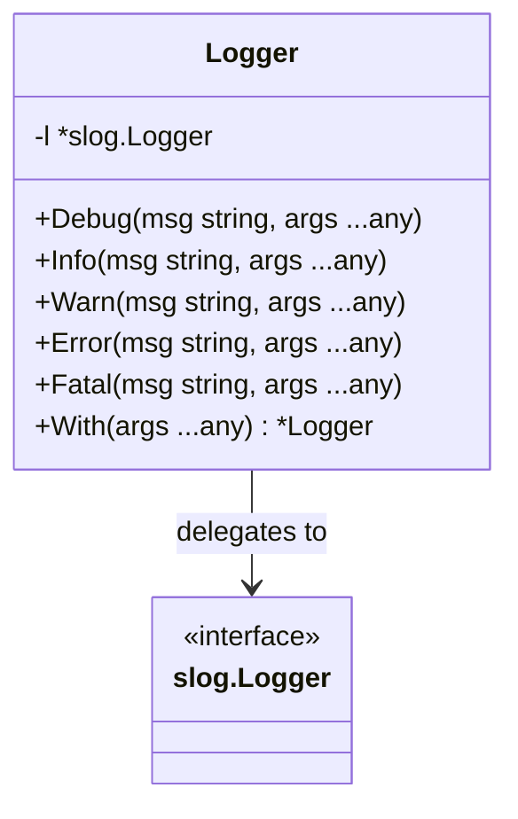

Logger` – A lightweight wrapper around Go’s standard `slog.Logger`

| Aspect | Details |
|--------|---------|
| **Location** | `github.com/redhat-best-practices-for-k8s/certsuite/internal/log` – file *log.go* line 28 |
| **Exported** | Yes (`Logger`) |
| **Purpose** | Provide a small, ergonomic API for structured logging that internally delegates to the standard library’s `slog.Logger`. It centralises common log‑level helpers and allows callers to create enriched loggers via context fields. |
| **Key Field** | ```go
l *slog.Logger
```<br> Holds the underlying logger instance; all operations are forwarded to it. |

---

### Methods

| Method | Signature | Responsibility |
|--------|-----------|----------------|
| `Debug` | `func (l *Logger) Debug(msg string, args ...any)` | Emits a log record at level **DEBUG** by delegating to the generic `Logf` helper. |
| `Info` | `func (l *Logger) Info(msg string, args ...any)` | Emits an **INFO**‑level record via `Logf`. |
| `Warn` | `func (l *Logger) Warn(msg string, args ...any)` | Emits a **WARN**‑level record via `Logf`. |
| `Error` | `func (l *Logger) Error(msg string, args ...any)` | Emits an **ERROR**‑level record via `Logf`. |
| `Fatal` | `func (l *Logger) Fatal(msg string, args ...any)` | Emits a **FATAL** record via `Logf`, then writes the message to `stderr` and calls `os.Exit(1)`. |
| `With` | `func (l *Logger) With(args ...any) *Logger` | Creates a new `Logger` that inherits all fields from `l` and appends the supplied key/value pairs. It simply forwards to the underlying logger’s `With` method. |

All methods are thin wrappers around the global helper **`Logf`**, which handles level parsing, record creation, and routing.

---

### How it fits into the package

* The package exposes two factory functions:
  * `GetLogger()` – returns a singleton default logger.
  * `GetMultiLogger(...io.Writer)` – builds a composite logger that writes to multiple destinations.

* **`SetLogger(*Logger)`** allows overriding the global instance, enabling tests or application code to inject custom loggers.

* The internal helper **`Logf`** is the workhorse: it parses the level string (e.g., `"debug"`, `"info"`), checks if that level is enabled, constructs a `slog.Record`, and passes it to the underlying handler. It also records caller information so logs point back to the correct source line.

Because `Logger` only contains a pointer to an `slog.Logger`, there are no side‑effects beyond those inherent in the standard logger (e.g., writing to `io.Writer`s). All state is immutable once created, making it safe for concurrent use across goroutines.

---

### Mermaid diagram (suggested)



This diagram illustrates that `Logger` is essentially a façade over the standard `slog.Logger`, adding convenience methods and optional field enrichment.
