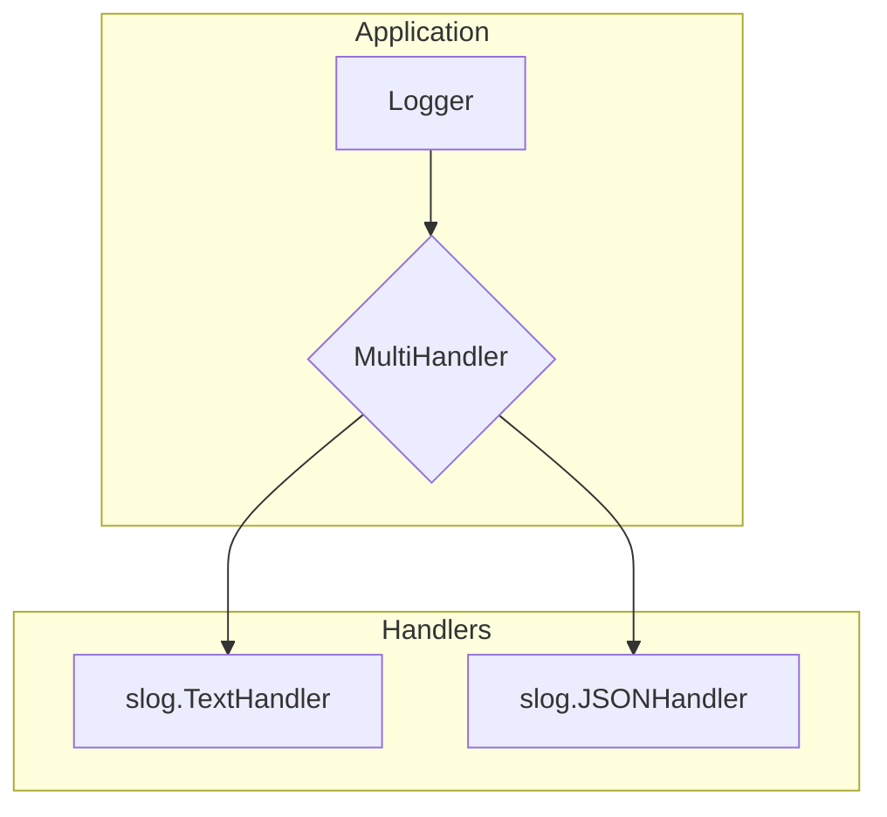

MultiHandler` – A Composite slog.Handler

The **`MultiHandler`** type implements Go’s `slog.Handler` interface by delegating log operations to a slice of child handlers.  
It allows an application to emit the same record through several sinks (e.g., console, file, network) in one go.

```go
type MultiHandler struct {
    handlers []slog.Handler // Handlers that receive each log record.
}
```

| Field | Type | Purpose |
|-------|------|---------|
| `handlers` | `[]slog.Handler` | Ordered collection of child handlers. Each handler receives the same `Record`. The order is preserved during emission.

---

### Constructor

```go
func NewMultiHandler(h ...slog.Handler) *MultiHandler
```

* **Input** – Zero or more existing handlers.
* **Output** – A pointer to a new `MultiHandler` that holds those handlers.
* **Side‑effects** – None; just allocates the struct.

---

### Interface Methods

| Method | Signature | Purpose |
|--------|-----------|---------|
| `Enabled(ctx context.Context, level slog.Level) bool` | `func(context.Context, slog.Level)(bool)` | Checks whether *any* child handler is enabled for the given level. It forwards the call to each underlying handler and returns `true` if at least one does. |
| `Handle(ctx context.Context, r slog.Record) error` | `func(context.Context, slog.Record)(error)` | Emits a record to every child handler. The method calls `Clone()` on the record before handing it off so that each handler receives an independent copy. Errors from any handler are returned as a composite error (the implementation detail is in the source). |
| `WithAttrs(attrs []slog.Attr) slog.Handler` | `func([]slog.Attr)(slog.Handler)` | Creates a new `MultiHandler` whose underlying handlers each receive the supplied attributes via their own `WithAttrs`. The original handler list is copied, and each child’s `WithAttrs` is invoked. |
| `WithGroup(name string) slog.Handler` | `func(string)(slog.Handler)` | Similar to `WithAttrs`, but creates a new group on every child handler using its `WithGroup` method.

All four methods are pure; they do not mutate the receiver except for creating new handlers in `WithAttrs`/`WithGroup`.

---

### How It Fits the Package

The package `github.com/redhat-best-practices-for-k8s/certsuite/internal/log` provides a lightweight wrapper around Go’s standard `log/slog`.  
`MultiHandler` is used when an application needs to log the same message to multiple destinations without writing duplicate code.

Typical usage:

```go
stdout := slog.NewTextHandler(os.Stdout, nil)
file   := slog.NewJSONHandler(fileWriter, nil)

mh := NewMultiHandler(stdout, file)

logger := slog.New(mh)
logger.Info("operation completed")
```

Here the same `Info` call is sent to both console and file.

---

### Mermaid Diagram (Suggested)



This diagram illustrates that the `slog.Logger` forwards every record to the `MultiHandler`, which then forwards it to each concrete handler.

---

**Key Dependencies**

* `context.Context` – passed through to child handlers.
* `slog.Handler` interface – all children must implement this.
* `slog.Record.Clone()` – ensures isolation between handlers during emission.

**Side Effects**

None beyond delegating work; no global state is modified. The only observable effect is that each underlying handler processes the log record independently.

---
