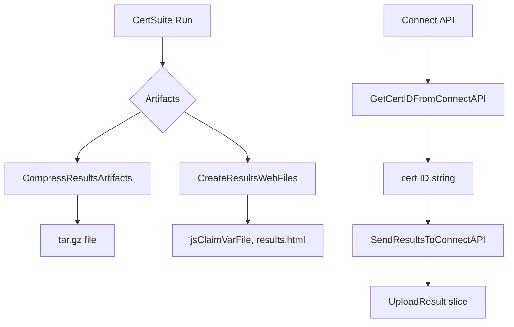
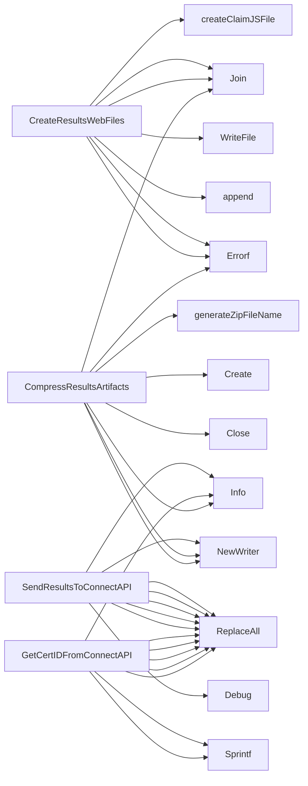

## Package results (github.com/redhat-best-practices-for-k8s/certsuite/internal/results)

## Package `results`

The **`results`** package is the glue that turns a finished CertSuite run into artifacts consumable by Red Hat Connect (the platform that stores and displays certification claims).  
It focuses on three responsibilities:

| Responsibility | Key data structures / globals | Main functions |
|----------------|--------------------------------|---------------|
| 1. **Archive results** | `tarGzFileNamePrefixLayout`, `tarGzFileNameSuffix` | `CompressResultsArtifacts` |
| 2. **Generate web‑viewable claim files** | `htmlResultsFileContent`, `writeFilePerms` | `CreateResultsWebFiles`, `createClaimJSFile` |
| 3. **Interact with Red Hat Connect API** | `CertIDResponse`, `UploadResult` | `GetCertIDFromConnectAPI`, `SendResultsToConnectAPI` |

Below we walk through each area, explaining the data flow and how the functions cooperate.

---

### 1. Archiving Results (`CompressResultsArtifacts`)

| Element | Description |
|---------|-------------|
| **Input** | `outputDir string` – directory where the archive will live.<br>`filePaths []string` – paths to the files that should be included (e.g., log files, PDFs). |
| **Output** | Path to a `.tar.gz` file in `outputDir`. |
| **Process** | 1. A unique filename is generated (`generateZipFileName`).<br>2. The function opens a new file and creates a gzip writer on top of it.<br>3. A tar writer writes each file’s header (via `getFileTarHeader`) followed by its contents, preserving the original relative path inside the archive.<br>4. All writers are closed cleanly; errors propagate upward. |

#### Helper Functions

| Name | Purpose |
|------|---------|
| `generateZipFileName()` | Uses `time.Now().Format("20060102-150405")` to create a timestamped base name, then appends the prefix/suffix constants (`tarGzFileNamePrefixLayout`, `tarGzFileNameSuffix`). |
| `getFileTarHeader(path)` | Calls `os.Stat` and `tar.FileInfoHeader` to produce a header that preserves file mode, size, and modification time. |

---

### 2. Generating Web‑viewable Claim Files (`CreateResultsWebFiles`)

The goal is to produce a small set of static files that can be opened in a browser to view the claim JSON.

| Element | Description |
|---------|-------------|
| **Inputs** | `claimJSONPath string` – path to the original `claim.json`.<br>`outputDir string` – where generated files will live. |
| **Outputs** | Slice of absolute paths for all created files (`results.html`, `classification.js`, `claimjson.js`). |

#### Flow

1. **Create claim JSON JS wrapper**  
   *`createClaimJSFile(claimJSONPath, outputDir)`* reads the raw JSON and writes it into a JavaScript file that assigns the JSON to a global variable (`var CLAIM_JSON = ...;`). The filename is `jsClaimVarFileName`.

2. **Copy the embedded HTML template**  
   The package embeds `results.html` via `//go:embed`. The function writes this byte slice to disk with permissions defined by `writeFilePerms`.

3. **Return the list of file paths** so that callers (e.g., a packaging routine) know which files to include in an archive or upload.

---

### 3. Red Hat Connect API Interaction

#### Data Structures

| Type | Fields | Typical use |
|------|--------|-------------|
| `CertIDResponse` | Holds the JSON returned by the “Get Cert ID” endpoint: case number, level, type, status, etc. | Parsed in `GetCertIDFromConnectAPI`. |
| `UploadResult` | Represents metadata for a file uploaded to Connect: name, size, UUID, download URL, timestamps, etc. | Returned from the upload endpoint and logged by `SendResultsToConnectAPI`. |

#### Key Functions

| Function | Signature | Responsibility |
|----------|-----------|----------------|
| `GetCertIDFromConnectAPI` | `(certName, orgName, certType, certLevel, certStatus string) (string, error)` | Builds a GET request to `/v1/certificates/search`, sends it via `sendRequest`, decodes the JSON response into `CertIDResponse`, and returns the ID as a string. |
| `SendResultsToConnectAPI` | `(certID, orgName, certType, certLevel, certStatus, outputDir string) error` | 1. Reads all result files from `outputDir`. <br>2. Builds a multipart/form‑data POST to `/v1/certificates/{id}/results`. <br>3. Adds form fields (`certType`, `orgName`, etc.) via `createFormField`. <br>4. Attaches each file using `CreateFormFile` and copies its contents. <br>5. Sends the request, parses the JSON response into a slice of `UploadResult`, logs them, and returns any error. |

#### Supporting Utilities

| Name | Purpose |
|------|---------|
| `createFormField(writer, key, value)` | Convenience wrapper that writes a simple form field; returns an error if writing fails. |
| `sendRequest(req, client)` | Calls `client.Do`, logs request/response details via the local logger (`log` package), and returns the response or error. |
| `setProxy(client, proxyURL, certFile)` | If a proxy is configured (via environment variables), this sets up the client's Transport with the proxy URL and optional TLS cert file. |

---

## Typical Workflow

1. **Run CertSuite** → produces logs, PDFs, and a `claim.json`.
2. **Archive artifacts**  
   ```go
   tarPath, _ := results.CompressResultsArtifacts(outDir, []string{logFile, pdf})
   ```
3. **Generate web files**  
   ```go
   _, _ = results.CreateResultsWebFiles(claimJSON, outDir)
   ```
4. **Obtain Cert ID from Connect**  
   ```go
   id, _ := results.GetCertIDFromConnectAPI(name, org, type, level, status)
   ```
5. **Upload everything**  
   ```go
   err := results.SendResultsToConnectAPI(id, org, type, level, status, outDir)
   ```

---

## Mermaid Diagram (Optional)



---

### Summary

- **Archiving** is handled by `CompressResultsArtifacts`, producing a `.tar.gz` of all result files.
- **Web viewability** relies on embedding an HTML template and generating a JS wrapper around the claim JSON.
- **Connect integration** involves two HTTP calls: one to retrieve a certification ID, another to POST all artifacts as multipart/form‑data. The `UploadResult` struct captures what Connect returns after each upload.

These components together enable CertSuite to deliver fully packaged, viewable results straight into Red Hat’s certification platform.

### Structs

- **CertIDResponse** (exported) — 7 fields, 0 methods
- **UploadResult** (exported) — 10 fields, 0 methods

### Functions

- **CompressResultsArtifacts** — func(string, []string)(string, error)
- **CreateResultsWebFiles** — func(string, string)([]string, error)
- **GetCertIDFromConnectAPI** — func(string, string, string, string, string)(string, error)
- **SendResultsToConnectAPI** — func(string, string, string, string, string, string)(error)

### Globals


### Call graph (exported symbols, partial)



### Symbol docs

- [struct CertIDResponse](symbols/struct_CertIDResponse.md)
- [struct UploadResult](symbols/struct_UploadResult.md)
- [function CompressResultsArtifacts](symbols/function_CompressResultsArtifacts.md)
- [function CreateResultsWebFiles](symbols/function_CreateResultsWebFiles.md)
- [function GetCertIDFromConnectAPI](symbols/function_GetCertIDFromConnectAPI.md)
- [function SendResultsToConnectAPI](symbols/function_SendResultsToConnectAPI.md)
