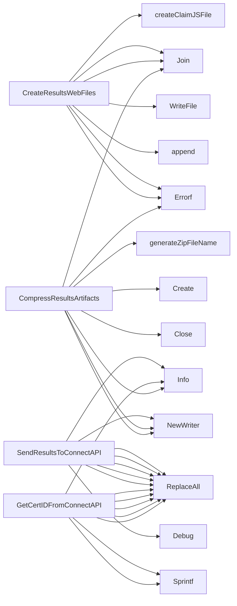

## Package results (github.com/redhat-best-practices-for-k8s/certsuite/internal/results)

### Structs

- **CertIDResponse** (exported) — 7 fields, 0 methods
- **UploadResult** (exported) — 10 fields, 0 methods

### Functions

- **CompressResultsArtifacts** — func(string, []string)(string, error)
- **CreateResultsWebFiles** — func(string, string)([]string, error)
- **GetCertIDFromConnectAPI** — func(string, string, string, string, string)(string, error)
- **SendResultsToConnectAPI** — func(string, string, string, string, string, string)(error)

### Globals

### Call graph (exported symbols, partial)

### Symbol docs

- [struct CertIDResponse](symbols/struct_CertIDResponse.md)
- [struct UploadResult](symbols/struct_UploadResult.md)
- [function CompressResultsArtifacts](symbols/function_CompressResultsArtifacts.md)
- [function CreateResultsWebFiles](symbols/function_CreateResultsWebFiles.md)
- [function GetCertIDFromConnectAPI](symbols/function_GetCertIDFromConnectAPI.md)
- [function SendResultsToConnectAPI](symbols/function_SendResultsToConnectAPI.md)
