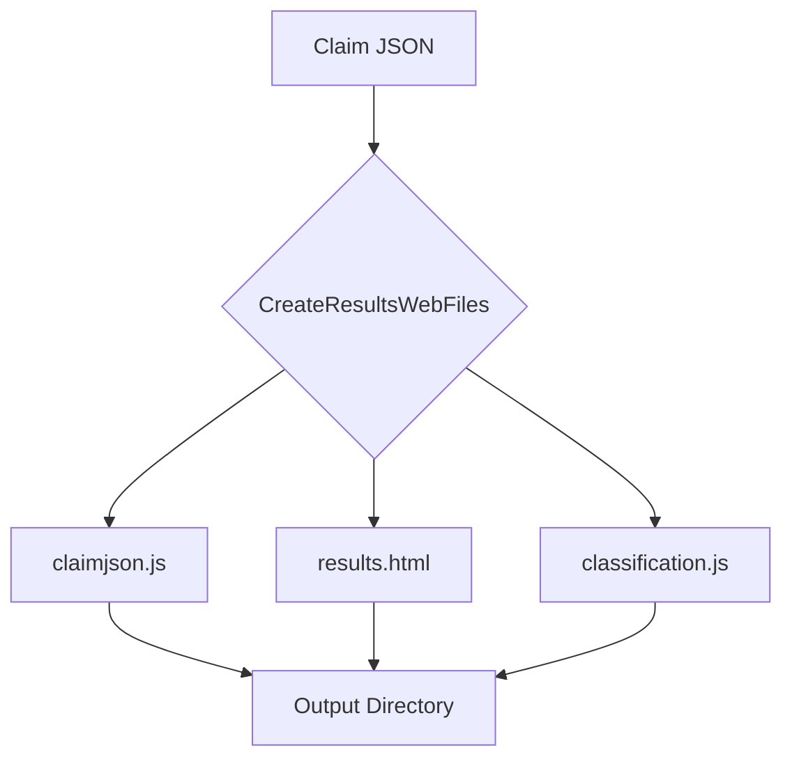

CreateResultsWebFiles`

| Item | Detail |
|------|--------|
| **Package** | `results` (`github.com/redhat-best-practices-for-k8s/certsuite/internal/results`) |
| **Signature** | `func CreateResultsWebFiles(claimJSONPath, outputDir string) ([]string, error)` |
| **Exported** | Yes |

### Purpose
Generates the web‑friendly artifacts that enable a browser to parse and display the test claim file:

1. **`claimjson.js`** – JavaScript file that exposes the JSON claim data as a global variable.
2. **`results.html`** – A static HTML page that loads `claimjson.js`, applies classification logic, and renders results.
3. **`classification.js`** – JavaScript that performs client‑side classification of the test outcomes.

The function writes these files into `outputDir` (creating the directory if necessary) and returns a slice containing the absolute paths to each file created. Any failure during writing aborts the operation and propagates an error.

### Parameters
| Name | Type | Description |
|------|------|-------------|
| `claimJSONPath` | `string` | Path to the JSON claim file that should be embedded in `claimjson.js`. |
| `outputDir` | `string` | Directory where the HTML, JS and auxiliary files will be created. |

### Return Values
| Name | Type | Meaning |
|------|------|---------|
| `[]string` | slice of string paths | Absolute paths to each generated file (`claimjson.js`, `results.html`, `classification.js`). |
| `error` | error | Non‑nil if any step fails (file creation, permission errors, etc.). |

### Key Steps & Dependencies
1. **Path construction** – Uses `filepath.Join` to build full paths for the three target files:
   * `claimJSFileName` (derived from a constant in this package).
   * `htmlResultsFileName` (`results.html` embedded via `go:embed` → `htmlResultsFileContent`).
   * `jsClaimVarFileName` (`classification.js` – a static JS bundle shipped with the binary).

2. **Write `claimjson.js`**  
   Calls helper `createClaimJSFile(claimJSONPath, claimJSFullPath)` which reads the JSON file and writes it wrapped as a JavaScript variable.

3. **Write `results.html`**  
   Uses `ioutil.WriteFile` (or Go 1.16+ `os.WriteFile`) with permissions defined by `writeFilePerms`. The content comes from the embedded byte slice `htmlResultsFileContent`.

4. **Write `classification.js`**  
   Reads the bundled JS file via `ReadFileFromEmbeddedResources` (not shown here) and writes it to disk.

5. **Collect paths** – Each successful write appends the absolute path to a result slice.

6. **Error handling** – If any step fails, an error is wrapped with context (`fmt.Errorf`) and returned immediately, halting further file creation.

### Side Effects
* Creates/overwrites three files in `outputDir`.  
* No global state is mutated; all work occurs locally to the provided paths.  
* Relies on filesystem permissions: if `outputDir` cannot be written to, an error will be returned.

### How It Fits the Package
The `results` package orchestrates post‑test reporting. After tests produce a claim JSON file and other artifacts, `CreateResultsWebFiles` prepares a self‑contained web view that can be opened locally or served by a static server. The generated files are later referenced in the tarball produced by `archiver.go`. Thus, this function bridges raw test output to an end‑user‑friendly presentation layer.

---

#### Suggested Mermaid Diagram (optional)

This diagram visualises the flow from the claim file to the three generated web assets.
