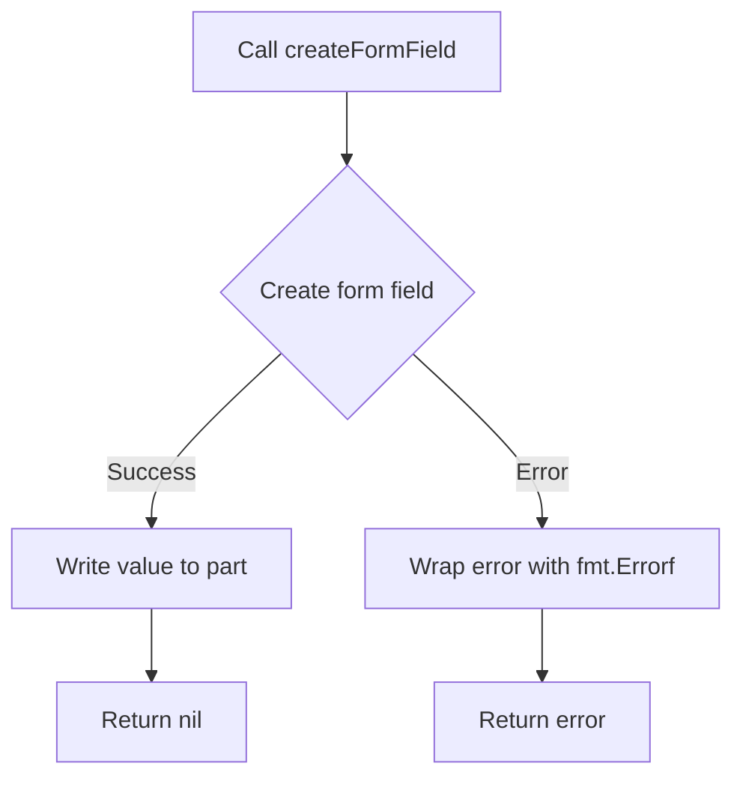

createFormField`

```go
func createFormField(w *multipart.Writer, name, value string) error
```

### Purpose
`createFormField` is a helper that adds a single **form‑field** part to an HTTP request body that uses the `multipart/form-data` encoding.  
It is used internally by the package when building a multipart payload to send to Red Hat Connect (RHConnect).  The function does not return any data other than a possible error, so its only observable effect is that the supplied writer contains one more part.

### Parameters

| Parameter | Type                | Description |
|-----------|---------------------|-------------|
| `w`       | `*multipart.Writer` | The writer to which the new form field will be appended. It must already have been created with a boundary and is typically tied to an HTTP request body. |
| `name`    | `string`            | The name of the form field (the key that will appear in the multipart payload). |
| `value`   | `string`            | The textual value of the field. It is written verbatim into the part’s body. |

### Return Value
* `error`:  
  * `nil` if the field was successfully added.  
  * A wrapped error from any of the underlying calls (`CreateFormField`, `Write`) otherwise.

### Key Dependencies & Calls

| Call | Purpose |
|------|---------|
| `w.CreateFormField(name)` | Creates a new part with the appropriate headers for a form field named `name`. |
| `part.Write([]byte(value))` | Writes the provided value into that part. |
| `fmt.Errorf(...)` | Wraps lower‑level errors with contextual information (e.g., “failed to create form field %q”). |

### Side Effects

* The multipart writer’s internal state is mutated: a new part is appended.
* No global variables or package‑wide state are altered.

### Context within the `results` Package
The `results` package generates artefacts for CertSuite test runs.  
When a test run needs to be reported to RHConnect, a multipart request is built that includes:
1. **Static files** (e.g., HTML result pages) written via separate helpers.
2. **Dynamic form fields** – e.g., the name of the test suite, timestamps, or other metadata.

`createFormField` provides the plumbing for step 2, keeping the multipart‑building logic in a single place and simplifying error handling across the package.

### Suggested Mermaid Flow (Optional)



---

**Note:** The function is unexported (`createFormField`) because it is intended for internal use only. External callers should construct multipart payloads directly via `multipart.Writer`.
