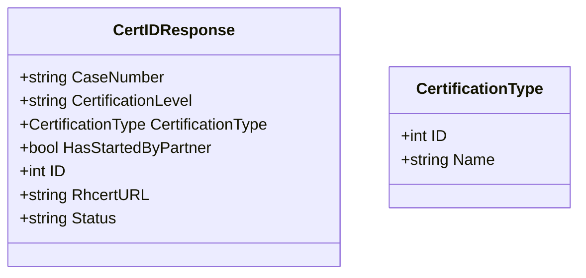

CertIDResponse` – Resulting data returned from RH Connect

| Element | Type | Description |
|---------|------|-------------|
| `CaseNumber` | `string` | Unique identifier assigned to the certification case in RH‑Connect. |
| `CertificationLevel` | `string` | The level of compliance (e.g., “C1”, “C2”) that the product claims to satisfy. |
| `CertificationType` | `struct{ ID int; Name string }` | Describes the type of certification being requested.  `ID` is the RH‑Connect numeric code, `Name` the human‑readable label (e.g., “Red Hat Certified”). |
| `HasStartedByPartner` | `bool` | Indicates whether the partner has initiated the certification workflow. |
| `ID` | `int` | The primary key of the case in the internal results database. |
| `RhcertURL` | `string` | Direct link to the RH‑Connect page for this case. |
| `Status` | `string` | Current status string returned by RH‑Connect (e.g., “Submitted”, “Approved”). |

### Purpose
`CertIDResponse` aggregates all information that a caller needs after submitting a certification request to Red Hat Connect.  
It is used by the **results** package to:

1. Persist the response in the local database (`internal/results`).
2. Expose a clean, serialisable struct to higher‑level packages or CLI tools.
3. Provide quick lookup of case metadata (URL, status) for audit and reporting.

### Inputs / Outputs
- **Input:** None – it is instantiated by unmarshalling the JSON payload returned from RH Connect’s API.
- **Output:** The populated struct is returned to callers that need to inspect or store the certification request details.

### Key Dependencies
- Relies on standard Go types (`int`, `string`, `bool`).
- Uses an anonymous struct for `CertificationType`; no external package is required.
- No methods are attached, so it serves purely as a data holder.

### Side Effects
- None. The struct has no methods that modify state or perform I/O.  
- When stored in the database (via `internal/results` helpers), the fields map directly to columns in the results table.

### Package Fit
Within the **results** package, `CertIDResponse` is part of the public API that other packages import when they need to:

- Translate RH Connect responses into a local representation.
- Pass certification metadata through internal workflows (e.g., generating reports).

The struct sits at the boundary between external REST communication and internal persistence. It is deliberately lightweight so that future extensions can add more fields without breaking existing consumers.

---

#### Suggested Mermaid diagram

This diagram visualises the composition of `CertIDResponse` and its nested type, helping developers quickly understand the data layout.
