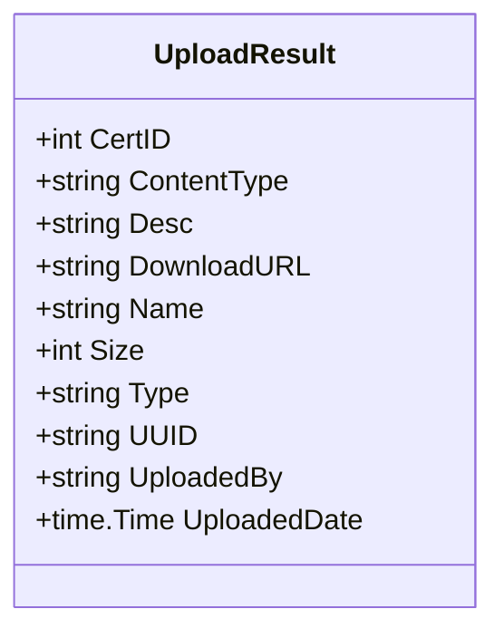

UploadResult` – Metadata for RH‑Connect uploads  

The **`UploadResult`** type is a plain data container that holds the metadata returned by the
Red Hat Connect API after a file has been uploaded.  
It lives in `internal/results/rhconnect.go` and is exported so callers can read the upload
information without needing to know the internals of the RH‑Connect client.

| Field | Type | Purpose |
|-------|------|---------|
| **CertID** | `int` | Identifier of the certificate (or artifact) that was uploaded. |
| **ContentType** | `string` | MIME type reported by the server for the uploaded file. |
| **Desc** | `string` | Human‑readable description supplied or returned by the API. |
| **DownloadURL** | `string` | HTTPS URL from which the uploaded artifact can be downloaded. |
| **Name** | `string` | Original filename of the upload. |
| **Size** | `int` | File size in bytes as reported by the server. |
| **Type** | `string` | Type/category of the artifact (e.g., “cert”, “key”). |
| **UUID** | `string` | Universally unique identifier assigned to the uploaded artifact. |
| **UploadedBy** | `string` | Username or service account that performed the upload. |
| **UploadedDate** | `time.Time` | Timestamp of when the upload completed (RFC3339 UTC). |

## Purpose & Usage

* **Return type** – Functions in `rhconnect.go` that perform uploads (`Upload`, `UploadFile`,
  etc.) return an `UploadResult` so callers can inspect what was stored.
* **No behavior** – The struct has no methods; it is a pure data holder.  
  All side‑effects occur in the upload functions, not when the struct is created.

## Key Dependencies

| Dependency | Reason |
|------------|--------|
| `time.Time` (standard library) | Provides a typed timestamp for `UploadedDate`. |

## How It Fits the Package

The `results` package centralises all data structures that represent responses from
the RH‑Connect API.  `UploadResult` is one of those response types and is used by:

```go
func Upload(ctx context.Context, file io.Reader) (*results.UploadResult, error)
```

and similar helpers in `rhconnect.go`.  
Consumers import the package to receive a typed representation of an upload operation,
allowing them to log or act upon metadata (e.g., storing `DownloadURL` for later retrieval).

---

### Suggested Mermaid Diagram



This diagram illustrates the structure’s fields and their visibility.
