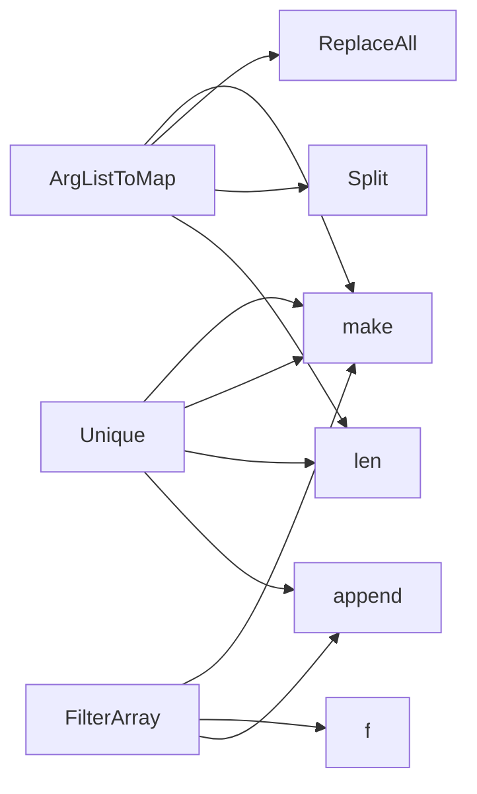

## Package arrayhelper (github.com/redhat-best-practices-for-k8s/certsuite/pkg/arrayhelper)

### Functions

- **ArgListToMap** — func([]string)(map[string]string)
- **FilterArray** — func([]string, func(string) bool)([]string)
- **Unique** — func([]string)([]string)

### Call graph (exported symbols, partial)

### Symbol docs

- [function ArgListToMap](symbols/function_ArgListToMap.md)
- [function FilterArray](symbols/function_FilterArray.md)
- [function Unique](symbols/function_Unique.md)
