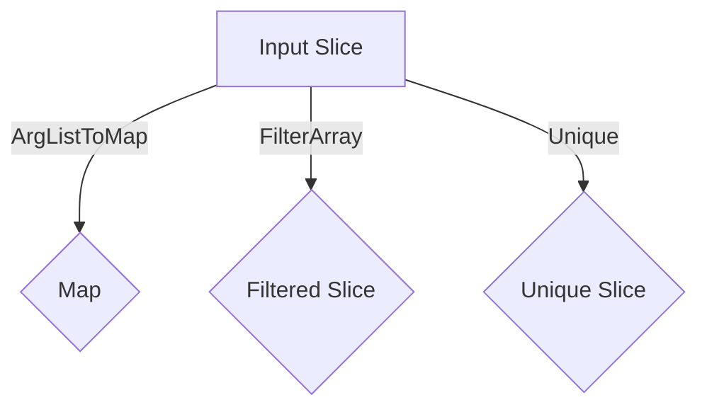
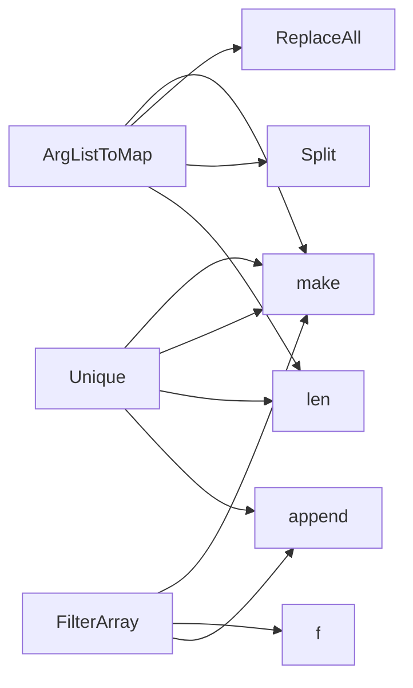

## Package arrayhelper (github.com/redhat-best-practices-for-k8s/certsuite/pkg/arrayhelper)

# `arrayhelper` – A Minimal Array Utility Package

| Item | Detail |
|------|--------|
| **Purpose** | Small helper functions that operate on slices of strings: parsing key/value pairs, filtering by a predicate, and removing duplicates. |
| **Imports** | `strings` (for string manipulation) |

## Data Flow & Functionality

### 1. `ArgListToMap`

```go
func ArgListToMap([]string) map[string]string
```

- **Input** – A slice of strings where each element follows the pattern `"key=value"`.
- **Process**
  1. Create a result map with an initial capacity equal to the slice length.
  2. Iterate over the slice, split each string on the first `=` (using `strings.Split`).
  3. Strip any surrounding whitespace from key and value (`strings.ReplaceAll` removes all spaces).
  4. Store the pair in the map.
- **Output** – A `map[string]string` containing every key/value pair.

> *Use‑case*: Convert command‑line arguments or configuration lists into a map for quick lookup.

### 2. `FilterArray`

```go
func FilterArray([]string, func(string) bool) []string
```

- **Input** –  
  - A slice of strings to filter.  
  - A predicate function that returns `true` when an element should be kept.
- **Process**
  1. Allocate a new slice with the same capacity as the input (to avoid reallocations).
  2. Iterate over the source slice; for each element, call the predicate.
  3. If the predicate returns `true`, append the element to the result slice.
- **Output** – A new slice containing only elements that satisfy the predicate.

> *Use‑case*: Filter environment variables, file lists, or any string list based on a condition.

### 3. `Unique`

```go
func Unique([]string) []string
```

- **Input** – A slice of strings that may contain duplicates.
- **Process**
  1. Create a map to track seen values (`seen := make(map[string]struct{})`).
  2. Iterate over the input, and for each string:
     - If it hasn't been seen before, add it to `seen` and append to the result slice.
- **Output** – A new slice with duplicate entries removed while preserving the original order of first occurrence.

> *Use‑case*: De‑duplicate command arguments or configuration keys.

## How They Connect

| Function | Calls | Shared Patterns |
|----------|-------|-----------------|
| `ArgListToMap` | `make`, `strings.Split`, `strings.ReplaceAll` | Builds a map from string pairs. |
| `FilterArray` | `make`, predicate function, `append` | Generates a new slice based on a condition. |
| `Unique` | `make` (for result and map), `append` | Uses a map as a set to track uniqueness. |

All functions are pure: they take input slices and return new data structures without modifying the originals.

## Suggested Mermaid Diagram



This diagram visualizes the three independent transformations applied to an input slice of strings.

### Functions

- **ArgListToMap** — func([]string)(map[string]string)
- **FilterArray** — func([]string, func(string) bool)([]string)
- **Unique** — func([]string)([]string)

### Call graph (exported symbols, partial)



### Symbol docs

- [function ArgListToMap](symbols/function_ArgListToMap.md)
- [function FilterArray](symbols/function_FilterArray.md)
- [function Unique](symbols/function_Unique.md)
