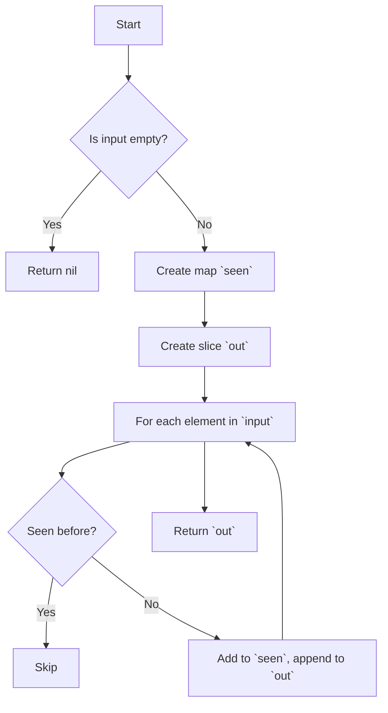

Unique` – Array de‑duplication helper

### Overview
`Unique` removes duplicate entries from a slice of strings while preserving the original order of first occurrences.  
It is part of the **arrayhelper** package, which supplies small utilities for manipulating Go slices.

```go
func Unique(input []string) []string
```

> **Return value:** A new slice containing each distinct string from `input` exactly once, in the same relative order they first appeared.

### Parameters

| Name | Type   | Description |
|------|--------|-------------|
| `input` | `[]string` | The source slice that may contain duplicates. |

### Return Value

| Type      | Description |
|-----------|-------------|
| `[]string` | A new slice containing the unique elements of `input`. |

### Algorithm & Dependencies
1. **Make a map** to track seen values (`seen := make(map[string]struct{})`).  
2. **Iterate over `input`**:
   - If an element is not in `seen`, append it to the result slice and mark it as seen.
3. The function uses only Go’s built‑in functions: `make`, `len`, `append`. No external packages or globals are referenced.

```go
func Unique(input []string) []string {
    if len(input) == 0 { return nil }
    seen := make(map[string]struct{}, len(input))
    out := make([]string, 0, len(input))
    for _, v := range input {
        if _, ok := seen[v]; !ok {
            seen[v] = struct{}{}
            out = append(out, v)
        }
    }
    return out
}
```

### Side Effects
- **No mutation** of the `input` slice.
- Allocates a new map and result slice proportional to the size of `input`.

### Package Context
The *arrayhelper* package groups small utilities that simplify common array operations (e.g., deduplication, sorting).  
`Unique` is the primary helper for removing duplicates from string slices and can be reused across the Certsuite codebase wherever unique lists are required.

---

#### Suggested Mermaid diagram



This visualizes the linear, single‑pass deduplication logic employed by `Unique`.
