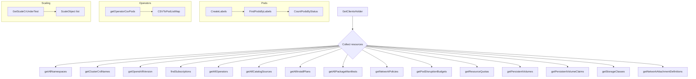
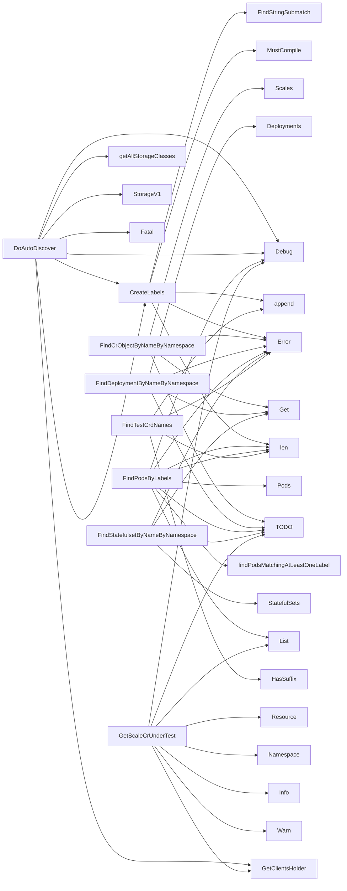

## Package autodiscover (github.com/redhat-best-practices-for-k8s/certsuite/pkg/autodiscover)

# Autodiscover – High‑level Overview

`autodiscover` is the core package that collects metadata about a Kubernetes / OpenShift cluster in order to prepare test data for CertSuite.  
It walks the API surface, filters resources by labels, annotations and user‑configured rules, and aggregates them into a single `DiscoveredTestData` structure.

Below you’ll find:

- **Key data structures** – what they hold and how they relate.
- **Global constants & variables** – used for label parsing, GVRs, etc.
- **Main workflow** – the order in which discovery functions are called.
- **Supporting helpers** – small utilities that drive the logic.

> All code paths are read‑only; no state is mutated outside of the local `data` variable inside `DoAutoDiscover`.

---

## 1. Core Data Structures

| Type | Purpose | Key fields |
|------|---------|------------|
| **`DiscoveredTestData`** (exported) | Final payload that test runners consume. | • `AllNamespaces`, `AllPods`, `AllServices`, … <br>• `Csvs`, `Subscriptions`, `Operators`, `InstallPlans`, `CatalogSources` <br>• `AbnormalEvents`, `ResourceQuotas`, `PodDisruptionBudgets` <br>• `ScaleCrUnderTest` (custom CR scaling objects) |
| **`PodStates`** | Count of pods *before* and *after* test execution. | `BeforeExecution map[string]int`, `AfterExecution map[string]int` |
| **`ScaleObject`** | Links a custom resource’s scale subresource to its GroupResource. | `GroupResourceSchema schema.GroupResource`, `Scale *scalingv1.Scale` |
| **`labelObject`** (unexported) | Holds the parsed label key/value used for filtering. | `LabelKey string`, `LabelValue string` |

> The package also keeps a private `data` variable of type `DiscoveredTestData`.  
> All helper functions write into this shared instance and finally return it from `DoAutoDiscover`.

---

## 2. Global Constants & Variables

| Name | Type | Role |
|------|------|------|
| `SriovNetworkGVR`, `SriovNetworkNodePolicyGVR` | `schema.GroupVersionResource` (implicit) | GVRs for custom resources that the package can query via the generic client. |
| `labelRegex`, `labelRegexMatches` | `*regexp.Regexp` | Compiled regex used to extract label key/value from a string such as `"app=web"`. |
| `labelTemplate` | `string` | Format string used in `CreateLabels` for generating `labelObject`s (`%s=%s`). |
| `probeHelperPodsLabelName/Value`, `tnfCsvTargetLabelName/Value`, `tnfLabelPrefix` | strings | Pre‑defined label names/values that identify probe helper pods and target CRDs. |
| `NonOpenshiftClusterVersion` | string | Marker used when the cluster is not OpenShift. |
| `csvNameWithNamespaceFormatStr` | string | Format for building a namespaced CSV key (`%s/%s`). |
| `data` (private) | `DiscoveredTestData` | The accumulating result; shared by all helpers. |

---

## 3. Main Workflow – `DoAutoDiscover`

```go
func DoAutoDiscover(cfg *configuration.TestConfiguration) DiscoveredTestData {
    // 1. Setup clients.
    ch := GetClientsHolder()

    // 2. Collect cluster‑wide metadata.
    getAllStorageClasses(...)
    getAllNamespaces(...)
    getClusterCrdNames()
    getOpenshiftVersion(...)

    // 3. Operators & CSVs
    subs := findSubscriptions(...)
    ops := getAllOperators(...)
    csvs, err := GetOperatorCsvPods(ops)
    //   → populates data.CSVToPodListMap

    // 4. Pods that match user‑defined labels.
    labels := CreateLabels(cfg.TestParameters.LabelSelectors)
    pods := FindPodsByLabels(ch.CoreV1(), labels, cfg.TestParameters.Namespace)
    data.Pods = pods
    data.PodStates.BeforeExecution = CountPodsByStatus(pods)

    // 5. Special pod sets (operator pods, probe helper pods, Istio)
    operandPods := getOperandPodsFromTestCsvs(csvs, pods)
    data.OpponentPods = operandPods

    // 6. Resources
    data.Deployments = findDeploymentsByLabels(...)
    data.StatefulSet = findStatefulSetsByLabels(...)
    data.Hpas = findHpaControllers(...)
    data.NetworkPolicies = getNetworkPolicies(...)
    data.PodDisruptionBudgets = getPodDisruptionBudgets(...)

    // 7. CRs & scaling objects
    crds := getClusterCrdNames()
    filteredCRDs := FindTestCrdNames(crds, cfg.TestParameters.CrdFilters)
    data.ScaleCrUnderTest = GetScaleCrUnderTest(cfg.TestParameters.Namespace, filteredCRDs)

    // 8. Operators (catalog sources, install plans, etc.)
    data.AllCatalogSources = getAllCatalogSources(...)
    data.AllInstallPlans = getAllInstallPlans(...)
    data.AllPackageManifests = getAllPackageManifests(...)

    // 9. RBAC & service accounts
    data.Roles = getRoles(...)
    data.RoleBindings = getRoleBindings(...)
    data.ClusterRoleBindings = getClusterRoleBindings(...)
    data.ServiceAccounts = getServiceAccounts(...)

    // 10. Miscellaneous
    data.AbnormalEvents = findAbnormalEvents(...)
    data.ResourceQuotas = getResourceQuotas(...)
    data.PersistentVolumes = getPersistentVolumes(...)
    data.PersistentVolumeClaims = getPersistentVolumeClaims(...)
    data.StorageClasses = getAllStorageClasses(...)
    data.NetworkAttachmentDefinitions = getNetworkAttachmentDefinitions(...)

    // 11. Return the populated struct
    return data
}
```

### Key Points

| Step | What is collected | How it’s filtered |
|------|-------------------|-------------------|
| **Labels** | `CreateLabels` parses user‑supplied label strings into `labelObject`s using a regex. | `FindPodsByLabels` calls `findPodsMatchingAtLeastOneLabel` which uses the labels to list pods across namespaces. |
| **Operators & CSVs** | Uses the Operator Lifecycle Manager (OLM) client (`operators/v1alpha1`) to list `CatalogSource`, `ClusterServiceVersion`, `Subscription`, etc. | No label filtering; all objects in target namespaces are collected. |
| **Scaling CRs** | `GetScaleCrUnderTest` obtains a scale subresource for each custom resource that matches the configured group filters. | It lists CR instances (`getCrScaleObjects`) and uses the generic scale client to fetch the `Scale`. |
| **Istio detection** | `isIstioServiceMeshInstalled` checks for a deployment named “istio‑pilot” in namespace “istio‑system”. | Direct API call; no label usage. |

---

## 4. Helper Functions – How They Interact

### Label Parsing & Pod Discovery

```go
func CreateLabels(labelStrings []string) []labelObject {
    // compile regex once (see global `labelRegex`)
    for _, s := range labelStrings {
        if m := labelRegex.FindStringSubmatch(s); len(m) == 3 {
            labels = append(labels, labelObject{m[1], m[2]})
        } else {
            log.Error("invalid label selector: %s", s)
        }
    }
}
```

`FindPodsByLabels` first checks if any labels were provided.  
If so, it calls `findPodsMatchingAtLeastOneLabel`, which performs a namespace‑wide list with no field selector and then filters the resulting pods in memory.

### Operator‑Pod Mapping

```go
func getOperatorCsvPods(csvs []*olmv1Alpha.ClusterServiceVersion) (map[types.NamespacedName][]*corev1.Pod, error) {
    for _, csv := range csvs {
        // The CSV’s namespace is the operator’s install namespace.
        pods, err := getPodsOwnedByCsv(csv.Name, csv.Namespace, ch)
        if err != nil { ... }
        key := types.NamespacedName{Namespace: csv.Namespace, Name: csv.Name}
        data.CSVToPodListMap[key] = pods
    }
}
```

`getPodsOwnedByCsv` lists all pods in the CSV’s namespace and keeps those whose top‑level owner is the CSV.

### Scaling CRs

```go
func GetScaleCrUnderTest(ns []string, crds []*apiextv1.CustomResourceDefinition) []ScaleObject {
    for _, crd := range crds {
        // list all CR instances in target namespaces
        objs, err := getCrScaleObjects(crd.Spec.Names.Group + "/" + crd.Spec.Names.Plural, ns)
        ...
        data.ScaleCrUnderTest = append(data.ScaleCrUnderTest, objs...)
    }
}
```

`getCrScaleObjects` uses the generic `Scales()` client to fetch the scale subresource for each CR instance.

---

## 5. Mermaid Diagram (Suggested)



---

## 6. Summary

* `DoAutoDiscover` orchestrates a series of API calls to pull **every** resource that might be relevant for testing: workloads, operators, CRDs, RBAC objects, networking primitives, and cluster status.
* The package is heavily driven by *label selectors* supplied in the test configuration; these drive pod discovery and operator selection.
* Custom resources that need scaling tests are identified via a group filter (`CrdFilter`) and then have their `Scale` subresource fetched.
* All discovered data is accumulated into a single `DiscoveredTestData` value, which downstream tests consume.

This design keeps the discovery logic isolated from test execution while still providing rich, structured context about the cluster under test.

### Structs

- **DiscoveredTestData** (exported) — 59 fields, 0 methods
- **PodStates** (exported) — 2 fields, 0 methods
- **ScaleObject** (exported) — 2 fields, 0 methods
- **labelObject**  — 2 fields, 0 methods

### Functions

- **CountPodsByStatus** — func([]corev1.Pod)(map[string]int)
- **CreateLabels** — func([]string)([]labelObject)
- **DoAutoDiscover** — func(*configuration.TestConfiguration)(DiscoveredTestData)
- **FindCrObjectByNameByNamespace** — func(scale.ScalesGetter, string, string, schema.GroupResource)(*scalingv1.Scale, error)
- **FindDeploymentByNameByNamespace** — func(appv1client.AppsV1Interface, string, string)(*appsv1.Deployment, error)
- **FindPodsByLabels** — func(corev1client.CoreV1Interface, []labelObject, []string)([]corev1.Pod)
- **FindStatefulsetByNameByNamespace** — func(appv1client.AppsV1Interface, string, string)(*appsv1.StatefulSet, error)
- **FindTestCrdNames** — func([]*apiextv1.CustomResourceDefinition, []configuration.CrdFilter)([]*apiextv1.CustomResourceDefinition)
- **GetScaleCrUnderTest** — func([]string, []*apiextv1.CustomResourceDefinition)([]ScaleObject)

### Globals

- **SriovNetworkGVR**: 
- **SriovNetworkNodePolicyGVR**: 

### Call graph (exported symbols, partial)



### Symbol docs

- [struct DiscoveredTestData](symbols/struct_DiscoveredTestData.md)
- [struct PodStates](symbols/struct_PodStates.md)
- [struct ScaleObject](symbols/struct_ScaleObject.md)
- [function CountPodsByStatus](symbols/function_CountPodsByStatus.md)
- [function CreateLabels](symbols/function_CreateLabels.md)
- [function DoAutoDiscover](symbols/function_DoAutoDiscover.md)
- [function FindCrObjectByNameByNamespace](symbols/function_FindCrObjectByNameByNamespace.md)
- [function FindDeploymentByNameByNamespace](symbols/function_FindDeploymentByNameByNamespace.md)
- [function FindPodsByLabels](symbols/function_FindPodsByLabels.md)
- [function FindStatefulsetByNameByNamespace](symbols/function_FindStatefulsetByNameByNamespace.md)
- [function FindTestCrdNames](symbols/function_FindTestCrdNames.md)
- [function GetScaleCrUnderTest](symbols/function_GetScaleCrUnderTest.md)
