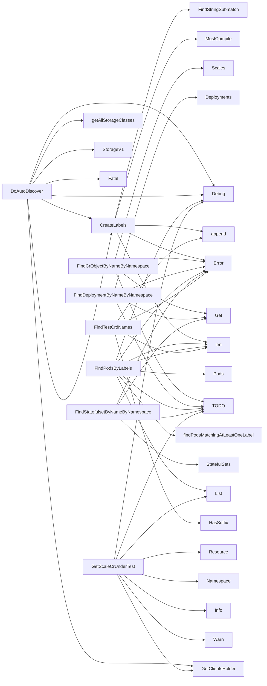

## Package autodiscover (github.com/redhat-best-practices-for-k8s/certsuite/pkg/autodiscover)

### Structs

- **DiscoveredTestData** (exported) — 59 fields, 0 methods
- **PodStates** (exported) — 2 fields, 0 methods
- **ScaleObject** (exported) — 2 fields, 0 methods
- **labelObject**  — 2 fields, 0 methods

### Functions

- **CountPodsByStatus** — func([]corev1.Pod)(map[string]int)
- **CreateLabels** — func([]string)([]labelObject)
- **DoAutoDiscover** — func(*configuration.TestConfiguration)(DiscoveredTestData)
- **FindCrObjectByNameByNamespace** — func(scale.ScalesGetter, string, string, schema.GroupResource)(*scalingv1.Scale, error)
- **FindDeploymentByNameByNamespace** — func(appv1client.AppsV1Interface, string, string)(*appsv1.Deployment, error)
- **FindPodsByLabels** — func(corev1client.CoreV1Interface, []labelObject, []string)([]corev1.Pod)
- **FindStatefulsetByNameByNamespace** — func(appv1client.AppsV1Interface, string, string)(*appsv1.StatefulSet, error)
- **FindTestCrdNames** — func([]*apiextv1.CustomResourceDefinition, []configuration.CrdFilter)([]*apiextv1.CustomResourceDefinition)
- **GetScaleCrUnderTest** — func([]string, []*apiextv1.CustomResourceDefinition)([]ScaleObject)

### Globals

- **SriovNetworkGVR**: 
- **SriovNetworkNodePolicyGVR**: 

### Call graph (exported symbols, partial)

### Symbol docs

- [struct DiscoveredTestData](symbols/struct_DiscoveredTestData.md)
- [struct PodStates](symbols/struct_PodStates.md)
- [struct ScaleObject](symbols/struct_ScaleObject.md)
- [function CountPodsByStatus](symbols/function_CountPodsByStatus.md)
- [function CreateLabels](symbols/function_CreateLabels.md)
- [function DoAutoDiscover](symbols/function_DoAutoDiscover.md)
- [function FindCrObjectByNameByNamespace](symbols/function_FindCrObjectByNameByNamespace.md)
- [function FindDeploymentByNameByNamespace](symbols/function_FindDeploymentByNameByNamespace.md)
- [function FindPodsByLabels](symbols/function_FindPodsByLabels.md)
- [function FindStatefulsetByNameByNamespace](symbols/function_FindStatefulsetByNameByNamespace.md)
- [function FindTestCrdNames](symbols/function_FindTestCrdNames.md)
- [function GetScaleCrUnderTest](symbols/function_GetScaleCrUnderTest.md)
